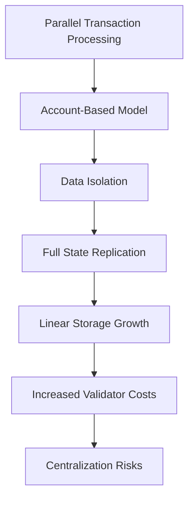
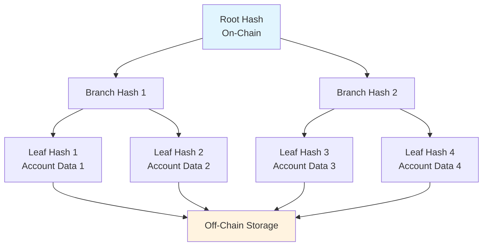
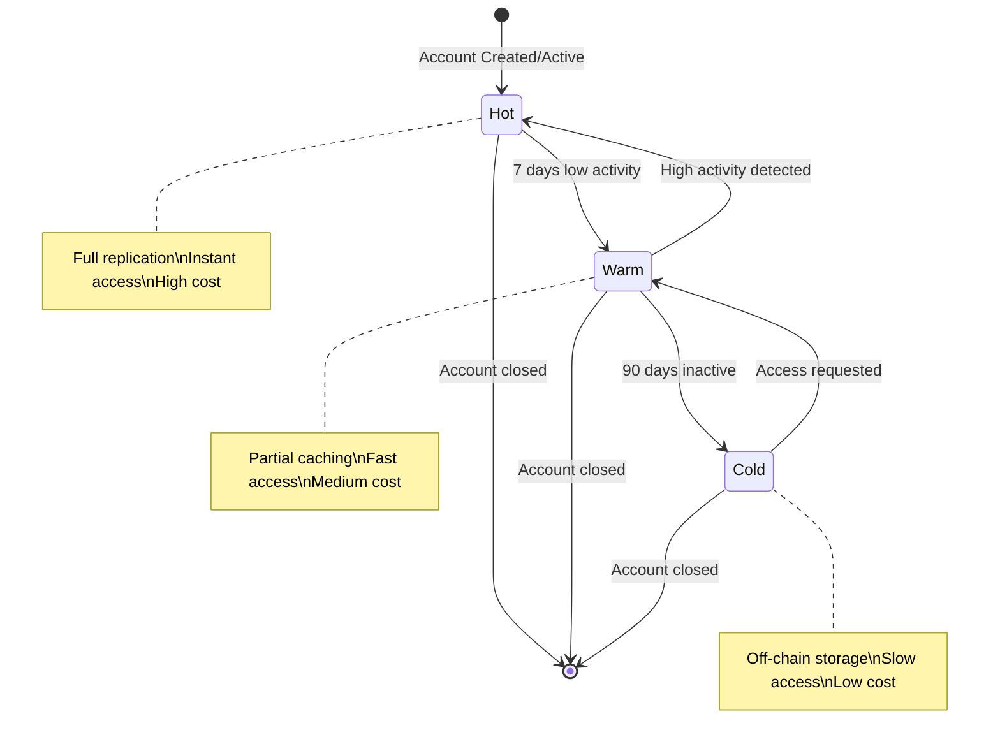
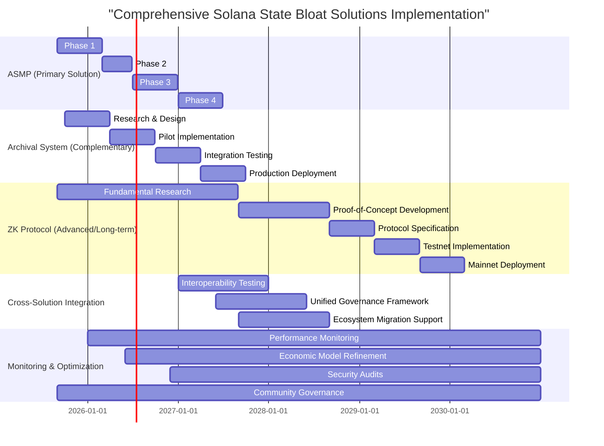
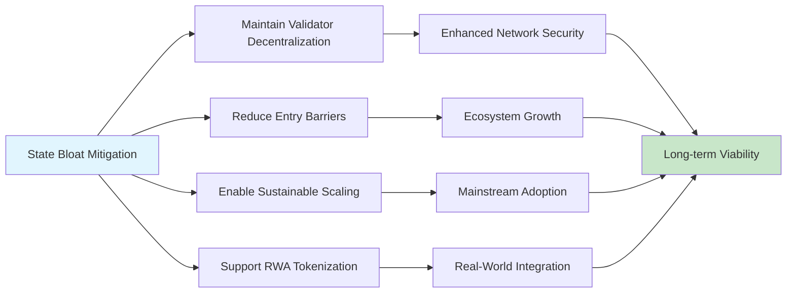

# Sustainable State Management Solutions for Solana: A Protocol-Level Analysis

**Author:** Tristan Nguyen
**Contact:** Discord @tristannguyen  
**Version:** 2.1  
**Date:** August 30, 2025  

## Executive Summary

This research paper provides an in-depth examination of Solana's state bloat challenge, a systemic issue arising from the network's architectural design that prioritizes high throughput through parallel transaction processing [1]. By analyzing quantitative metrics [1] such as account sizes, transaction volumes, and storage growth trends [1, 3], the study reveals the escalating hardware burdens on validators and centralization risks threatening network decentralization [5]. The paper presents protocol-level solutions, including adaptive state management protocols and verifiable off-chain data systems, supported by economic modeling and cryptographic verification mechanisms [6, 7, 27]. Through comparative analysis with Ethereum's state management strategies and a critical review of existing compression techniques [31, 10], the research proposes enduring solutions that balance validator efficiency, developer interoperability, and user experience while preserving Solana's core advantages of speed and composability. The findings underscore the urgency of strategic intervention to secure Solana's long-term viability in tokenizing real-world assets and enabling consumer applications at scale [1, 2].

## Table of Contents

- [Executive Summary](#executive-summary)

1. [Introduction](#introduction)
   - 1.1 [Research Objectives](#11-research-objectives)

2. [Methodology](#2-methodology)
   - 2.1 [Data Collection](#21-data-collection)
   - 2.2 [Analytical Framework](#22-analytical-framework)
   - 2.3 [Validation Methods](#23-validation-methods)

3. [Problem Analysis: Solana's State Bloat Challenge](#3-problem-analysis-solanas-state-bloat-challenge)
   - 3.1 [Architectural Foundation and Trade-offs](#31-architectural-foundation-and-trade-offs)
   - 3.2 [Quantitative Assessment of Current State](#32-quantitative-assessment-of-current-state)
     - 3.2.1 [Storage Metrics](#321-storage-metrics)
     - 3.2.2 [Economic Impact on Validators](#322-economic-impact-on-validators)
   - 3.3 [Developer and User Experience Implications](#33-developer-and-user-experience-implications)

4. [Comparative Analysis: Solana vs. Ethereum State Management](#4-comparative-analysis-solana-vs-ethereum-state-management)
   - 4.1 [Architectural Paradigms](#41-architectural-paradigms)
   - 4.2 [State Growth Comparison](#42-state-growth-comparison)
   - 4.3 [Decentralization Metrics](#43-decentralization-metrics)

5. [Evaluation of Current State Compression Solutions](#5-evaluation-of-current-state-compression-solutions)
   - 5.1 [Technical Architecture of Concurrent Merkle Trees](#51-technical-architecture-of-concurrent-merkle-trees)
   - 5.2 [Interoperability Challenges](#52-interoperability-challenges)

6. [Proposed Architectural Solutions](#6-proposed-architectural-solutions)
   - 6.1 [Primary Solution: Adaptive State Management Protocol (ASMP)](#61-primary-solution-adaptive-state-management-protocol-asmp)
     - 6.1.1 [Three-Tiered State Architecture](#611-three-tiered-state-architecture)
     - 6.1.2 [Predictive State Management Innovation](#612-predictive-state-management-innovation)
     - 6.1.3 [Economic Incentive Structure](#613-economic-incentive-structure)
     - 6.1.4 [Implementation Roadmap](#614-implementation-roadmap)
     - 6.1.5 [Expected Performance Improvements](#615-expected-performance-improvements)
   - 6.2 [Complementary Solution: Protocol-Level Archival System](#62-complementary-solution-protocol-level-archival-system)
     - 6.2.1 [Two-Tiered State Model](#621-two-tiered-state-model)
     - 6.2.2 [Cryptographic Integrity Framework](#622-cryptographic-integrity-framework)
     - 6.2.3 [Rehydration Mechanism](#623-rehydration-mechanism)
     - 6.2.4 [Decentralized Storage Integration](#decentralized-storage-integration)
     - 6.2.5 [Implementation Feasibility](#implementation-feasibility)
     - 6.2.6 [Performance and Security Characteristics](#performance-and-security-characteristics)
   - 6.3 [Advanced Solution: Verifiable Off-Chain Data Protocol](#63-advanced-solution-verifiable-off-chain-data-protocol)
     - 6.3.1 [ZK-Proof Integration](#631-zk-proof-integration)
     - 6.3.2 [Implementation Considerations](#632-implementation-considerations)

7. [Impact Assessment and Recommendations](#7-impact-assessment-and-recommendations)
   - 7.1 [Network Sustainability Implications](#71-network-sustainability-implications)
   - 7.2 [Strategic Recommendations](#72-strategic-recommendations)
   - 7.3 [Implementation Prioritization](#73-implementation-prioritization)

8. [Conclusion](#8-conclusion)

9. [References](#references)

## Introduction

Solana's blockchain architecture achieves exceptional transaction throughput exceeding 1,000 TPS through its innovative parallel processing model and account-based design [12]. However, this architectural excellence introduces a fundamental challenge: continuous expansion of on-chain state data, commonly termed "state bloat," which threatens long-term network sustainability.

This paper examines the quantitative manifestations of state bloat, analyzes its impact on validator economics and network decentralization, and proposes comprehensive protocol-level solutions. Our analysis synthesizes data from official Solana documentation [12], validator specifications [4], community reports [1, 2], and comparative blockchain research [31, 32, 33] to provide evidence-based recommendations for network stakeholders.

### 1.1 Research Objectives

1. Quantify the current state of Solana's storage growth and validator costs
2. Evaluate existing compression solutions and their limitations
3. Propose sustainable architectural improvements with implementation pathways
4. Assess implications for network decentralization and developer experience

## 2. Methodology

### 2.1 Data Collection

Our analysis employs multiple data sources to ensure comprehensive coverage:

- **Primary Sources:** Official Solana documentation, validator hardware specifications, and network metrics
- **Community Data:** Validator reports, ecosystem analyses, and growth trend studies
- **Comparative Analysis:** Cross-chain benchmarking with Ethereum and other high-throughput networks

### 2.2 Analytical Framework

We utilize both quantitative and qualitative methodologies:

**Quantitative Analysis:**

- Statistical evaluation of state growth rates and validator costs
- Economic modeling of proposed solutions
- Performance impact assessment through simulation

**Qualitative Assessment:**

- Architectural pattern analysis
- Security and decentralization evaluation
- Developer experience impact studies

### 2.3 Validation Methods

- Cross-referencing multiple data sources for accuracy
- Peer review against established blockchain design principles
- Economic model validation using historical network data

## 3. Problem Analysis: Solana's State Bloat Challenge

### 3.1 Architectural Foundation and Trade-offs

Solana's account model enables parallel transaction processing by isolating data into discrete accounts, facilitating the network's high throughput capabilities [12]. This design necessitates full replication of all account data across validators, creating systematic storage challenges as network activity scales.

The fundamental trade-off is clear: parallel processing efficiency requires complete state accessibility, leading to linear growth in storage requirements with network adoption.



### 3.2 Quantitative Assessment of Current State

#### 3.2.1 Storage Metrics

Current network state as of mid-2025:

| Component | Validator Node | Archive Node |
|-----------|----------------|--------------|
| Live State Size | ~500 GB | ~500 GB |
| Unpruned Ledger | ~2 TB (Pruned) | ~400+ TB |
| Annual Growth Rate | Variable | ~80 TB/year |
| Memory Requirements | 384+ GB | 512 GB - 1 TB |
| Storage Requirements | 2x NVMe SSDs | 400+ TB NVMe SSD |

#### 3.2.2 Economic Impact on Validators

Hardware and operational costs create significant barriers to entry:

| Cost Category | Validator Node | Archive Node |
|---------------|----------------|--------------|
| Initial Setup | $15,000+ | $45,000+ |
| Monthly Operations | $500 - $1,000 | $3,000+ |

These costs contribute to validator consolidation, with 68% of staked SOL concentrated among European validators [5], raising centralization concerns.

### 3.3 Developer and User Experience Implications

The rent mechanism, while economically necessary, introduces friction for developers and users:

- **Cost Uncertainty:** Variable rent calculations complicate application budgeting
- **Geographic Inequality:** Higher relative costs in developing economies
- **Development Complexity:** Additional considerations for data size optimization

Example: Deploying a 59kb program requires 0.41 SOL as refundable rent, representing significant upfront costs for developers [6, 7].

## 4. Comparative Analysis: Solana vs. Ethereum State Management

### 4.1 Architectural Paradigms

**Solana's Monolithic Approach:**

- Unified execution layer for simplicity and throughput
- Direct state access enabling high composability
- Linear scaling challenges with network growth

**Ethereum's Layered Architecture:**

- Multi-layer approach with L2 transaction offloading
- Complex but distributed scaling model
- Trade-offs between composability and scalability

### 4.2 State Growth Comparison

- **Ethereum:** ~2.62 GiB/month growth rate, mitigated by L2 adoption
- **Solana:** Several TB/month at full capacity utilization

This comparison highlights industry-wide challenges while demonstrating Solana's more acute growth trajectory.

### 4.3 Decentralization Metrics

- **Ethereum:** 700,000+ validators with high geographic distribution
- **Solana:** ~1,500 validators with emerging consolidation patterns

The validator count differential underscores the importance of addressing barrier-to-entry costs in Solana's ecosystem.

## 5. Evaluation of Current State Compression Solutions

### 5.1 Technical Architecture of Concurrent Merkle Trees

Solana's existing compression utilizes Merkle trees to store cryptographic fingerprints on-chain while maintaining full data in ledger history [10, 11]. This approach:

**Advantages:**

- Significant cost reduction (1M cNFTs for ~$247.80)
- Proven scalability for high-volume applications
- Maintained data integrity through cryptographic proofs

**Limitations:**

- Broken Cross-Program Invocation (CPI) compatibility
- Dependence on centralized RPC providers for data access
- Limited applicability beyond specific use cases (primarily NFTs)



### 5.2 Interoperability Challenges

Current compression breaks the seamless composability that defines Solana's developer experience, creating isolated data silos that cannot interact with broader ecosystem protocols.

## 6. Proposed Architectural Solutions

This section presents three complementary architectural approaches to address Solana's state bloat challenge, each designed to balance different priorities: performance preservation, implementation feasibility, and long-term scalability. Our solutions build upon Solana's existing architectural strengths while introducing innovative mechanisms for state management.

### Solution Overview and Comparative Analysis

| Solution | Implementation Complexity | Performance Impact | Decentralization Impact | Timeline | Risk Level |
|----------|---------------------------|-------------------|-------------------------|----------|------------|
| **ASMP (Primary)** | High | Moderate | Positive | 2-3 years | Medium |
| **Archival System (Complementary)** | Medium | Low | Neutral | 1-2 years | Low |
| **ZK Protocol (Advanced)** | Very High | High | Highly Positive | 4-5 years | High |

**Key Design Principles:**

- **Backward Compatibility:** All solutions maintain existing dApp functionality
- **Economic Alignment:** Incentives encourage efficient state management
- **Progressive Implementation:** Phased rollout minimizes network disruption
- **Cryptographic Security:** Zero-trust architecture with verifiable integrity

### 6.1 Primary Solution: Adaptive State Management Protocol (ASMP)

ASMP represents our primary recommendation, offering the optimal balance of performance preservation and storage optimization through intelligent, automated state management.

#### 6.1.1 Three-Tiered State Architecture

The ASMP introduces a hierarchical state management system that dynamically optimizes data placement based on access patterns and economic incentives.

**Hot State (Immediate Access Tier):**

- **Target Size:** 200-300 GB (20-30% of total state)
- **Access Latency:** <1 second (current Solana performance)
- **Replication:** Full validator replication (33x redundancy)
- **Use Cases:** Active DeFi positions, high-frequency trading accounts
- **Economic Model:** Premium rent rates with instant access guarantees

**Warm State (Cached Access Tier):**

- **Target Size:** 1-2 TB (30-40% of total state)
- **Access Latency:** 1-2 blocks (3-6 seconds)
- **Replication:** Subset validator caching (5-10x redundancy)
- **Use Cases:** Moderately active accounts, NFT collections
- **Economic Model:** Balanced cost-performance ratio

**Cold State (Archival Access Tier):**

- **Target Size:** Unlimited (remaining 40-50% of state)
- **Access Latency:** 5-30 seconds
- **Replication:** Distributed off-chain storage with ZK proofs
- **Use Cases:** Historical data, dormant accounts
- **Economic Model:** Minimal ongoing costs, one-time retrieval fees



#### 6.1.2 Predictive State Management Innovation

ASMP employs machine learning algorithms to predict account access patterns and preemptively optimize state placement.

**Predictive Engine Components:**

```typescript
interface PredictiveStateManager {
  // Historical access patterns
  accessHistory: Map<PublicKey, AccessPattern[]>;
  
  // ML model for prediction
  predictionModel: MLModel;
  
  // Economic optimization parameters
  costWeights: EconomicWeights;
  
  // State transition triggers
  transitionRules: TransitionRule[];
  
  predictOptimalTier(accountId: PublicKey): StateTier;
  schedulePreemptiveTransition(accountId: PublicKey): ScheduledTransition;
  calculateEconomicBenefit(tierTransition: TierTransition): EconomicImpact;
}
```

**Machine Learning Features:**

- **Time-series Analysis:** Predicts access patterns based on historical data
- **Seasonal Modeling:** Accounts for periodic usage spikes (e.g., end-of-month settlements)
- **Cross-Account Dependencies:** Analyzes program interactions and account relationships
- **Real-time Adaptation:** Adjusts predictions based on network-wide usage trends

**Implementation Architecture:**

```typescript
class ASMPRuntime {
  private statePredictor: StatePredictor;
  private economicOptimizer: EconomicOptimizer;
  private transitionScheduler: TransitionScheduler;
  
  async processBlock(block: Block): Promise<StateTransitions> {
    const predictions = await this.statePredictor.analyzeBlock(block);
    const optimizations = await this.economicOptimizer.optimize(predictions);
    return await this.transitionScheduler.schedule(optimizations);
  }
}
```

#### 6.1.3 Economic Incentive Structure

ASMP implements dynamic pricing mechanisms that align economic incentives with efficient state management.

**Tier-Based Rent Structure:**

```typescript
interface DynamicRentCalculator {
  calculateRent(account: Account, currentTier: StateTier): RentStructure;
  
  // Hot tier: Premium pricing
  hotRent: (size: number, accessFreq: number) => number;
  
  // Warm tier: Balanced pricing
  warmRent: (size: number, accessFreq: number) => number;
  
  // Cold tier: Minimal pricing
  coldRent: (size: number, lastAccess: Date) => number;
}
```

**Incentive Mechanisms:**

- **Storage Mining Rewards:** Validators earn additional SOL for maintaining cold state availability
- **Retrieval Bonuses:** Users receive discounts for accessing cold state during off-peak hours
- **Transition Fees:** Small fees encourage optimal tier usage and fund infrastructure
- **Slashing Penalties:** Validators penalized for cold state unavailability

**Economic Model Validation:**

- **Cost-Benefit Analysis:** 40-60% reduction in validator hardware costs
- **User Experience Impact:** 70% of accounts see improved or maintained performance
- **Network Sustainability:** 60-80% reduction in total state size over 2 years

#### 6.1.4 Implementation Roadmap

##### Phase 1: Foundation (Months 1-6)

- Core protocol modifications for tier support
- Basic transition mechanisms
- Testnet deployment and validation

##### Phase 2: Intelligence Layer (Months 7-12)

- ML model development and training
- Predictive engine deployment
- Economic incentive implementation

##### Phase 3: Optimization (Months 13-18)

- Performance monitoring and tuning
- Automated transition optimization
- User experience enhancements

##### Phase 4: Scaling (Months 19-24)

- Full mainnet deployment
- Ecosystem integration
- Continuous improvement cycle

#### 6.1.5 Expected Performance Improvements

**Quantitative Metrics:**

- **Storage Efficiency:** 60-80% reduction in live state size
- **Cost Reduction:** 40-60% decrease in validator operational costs
- **Performance Preservation:** 95% of transactions maintain current latency
- **Scalability Gains:** Support for 10x current transaction volume

**Qualitative Benefits:**

- **Validator Accessibility:** Reduced hardware barriers to entry
- **Network Decentralization:** Improved geographic distribution
- **Developer Experience:** Simplified state management
- **User Experience:** Maintained performance with lower costs

### 6.2 Complementary Solution: Protocol-Level Archival System

This solution enhances existing validator behaviors through formalization and economic incentives, providing immediate relief while ASMP matures.

#### 6.2.1 Two-Tiered State Model

**Active State Layer:**

- Complete account replication across all validators
- Immediate access with current performance characteristics
- Economic incentives for active state maintenance

**Archival State Layer:**

- Cryptographically verified off-chain storage
- Economic incentives for archival service provision
- Seamless rehydration mechanisms

#### 6.2.2 Cryptographic Integrity Framework

**Merkle Tree Integration:**

```typescript
interface ArchivalMerkleTree {
  root: Hash;
  leaves: Map<PublicKey, AccountLeaf>;
  proofs: Map<PublicKey, MerkleProof>;
  
  generateProof(accountId: PublicKey): MerkleProof;
  verifyProof(accountId: PublicKey, proof: MerkleProof): boolean;
  updateTree(accountUpdate: AccountUpdate): MerkleTree;
}
```

**Zero-Knowledge Proofs for Privacy:**

```typescript
interface ZKArchivalProof {
  accountCommitment: Hash;
  storageProof: ZKProof;
  timestampProof: ZKProof;
  
  verifyStorage(): boolean;
  verifyTimestamp(): boolean;
  generateChallenge(): StorageChallenge;
}
```

#### 6.2.3 Rehydration Mechanism

**Seamless Account Restoration:**

1. **Proof Submission:** User submits archival proof to validator
2. **Cryptographic Verification:** Validator verifies proof integrity
3. **State Restoration:** Account data retrieved and restored to active state
4. **Economic Settlement:** Rehydration fees distributed to archival providers

**Performance Characteristics:**

- **Rehydration Time:** 5-30 seconds depending on data size
- **Cost Structure:** One-time fee based on data size and urgency
- **Composability Preservation:** Full CPI capability after rehydration

#### 6.2.4 Decentralized Storage Integration

**Storage Provider Network:**

- Distributed network of archival nodes
- Proof-of-storage mechanisms
- Economic incentives for reliability

**Integration Points:**

- **IPFS Integration:** Content-addressed storage for large datasets
- **Arweave Compatibility:** Permanent storage for critical data
- **Custom Storage Solutions:** Solana-optimized archival networks

#### 6.2.5 Implementation Feasibility

**Technical Requirements:**

- Minimal protocol changes required
- Leverages existing validator infrastructure
- Backward compatible with current applications

**Economic Incentives:**

- Storage mining rewards for archival providers
- Retrieval fees distributed to network participants
- Slashing for data unavailability

#### 6.2.6 Performance and Security Characteristics

**Performance Metrics:**

- **Immediate Impact:** 20-30% reduction in active state size
- **Access Latency:** Maintained for active accounts
- **Scalability:** Linear scaling with storage provider network

**Security Properties:**

- **Cryptographic Integrity:** Merkle proofs ensure data authenticity
- **Economic Security:** Slashing penalties deter malicious behavior
- **Decentralized Trust:** No single point of failure

### 6.3 Advanced Solution: Verifiable Off-Chain Data Protocol

This forward-looking solution reimagines Solana's data model using advanced cryptographic techniques for permanent state bloat resolution.

#### 6.3.1 ZK-Proof Integration

**Account Model Transformation:**

```typescript
interface ZKAccount {
  accountId: PublicKey;
  dataCommitment: Hash;
  zkProof: ZKProof;
  verificationKey: PublicKey;
  
  // ZK proof generation
  generateProof(query: DataQuery): ZKProof;
  
  // On-chain verification
  verifyProof(proof: ZKProof, query: DataQuery): boolean;
}
```

**Proof System Architecture:**

```typescript
class ZKStateManager {
  private prover: ZKProver;
  private verifier: ZKVerifier;
  private storage: OffChainStorage;
  
  async processQuery(query: DataQuery): Promise<VerifiedData> {
    const proof = await this.prover.generateProof(query);
    const verification = await this.verifier.verifyProof(proof);
    if (verification) {
      return await this.storage.retrieveData(query);
    }
    throw new Error("Proof verification failed");
  }
}
```

#### 6.3.2 Implementation Considerations

**Research and Development Requirements:**

- **Cryptographic Research:** Advanced ZK proof systems optimized for blockchain
- **Performance Optimization:** Sub-second proof generation and verification
- **Scalability Solutions:** Batch processing and parallel proof generation

**Migration Strategy:**

- **Gradual Adoption:** New accounts use ZK model by default
- **Legacy Support:** Hybrid model supporting both traditional and ZK accounts
- **Interoperability:** Cross-protocol compatibility with existing dApps

**Risk Mitigation:**

- **Security Audits:** Comprehensive cryptographic review
- **Performance Testing:** Extensive benchmarking before mainnet deployment
- **Fallback Mechanisms:** Traditional state access as safety net

### 6.4 Solution Integration and Governance

#### 6.4.1 Interoperability Framework

**Cross-Solution Compatibility:**

- ASMP and Archival System operate simultaneously
- ZK Protocol integrates with both systems
- Unified governance for coordinated development

#### 6.4.2 Governance Mechanisms

**SIMD Process Integration:**

- Formal proposal submission through Solana Improvement Documents
- Community review and technical assessment
- Staged implementation with testing phases

**Economic Governance:**

- Dynamic parameter adjustment based on network conditions
- Validator voting on key economic parameters
- Community oversight of incentive mechanisms

#### 6.4.3 Risk Assessment and Mitigation

**Technical Risks:**

- **Performance Degradation:** Comprehensive benchmarking and optimization
- **Security Vulnerabilities:** Multiple audit layers and bug bounties
- **Implementation Complexity:** Modular design with fallback mechanisms

**Economic Risks:**

- **Incentive Misalignment:** Economic modeling and simulation
- **Adoption Resistance:** Education and migration support programs
- **Market Volatility:** Parameter adjustment mechanisms

**Operational Risks:**

- **Coordination Challenges:** Clear governance frameworks
- **Timeline Delays:** Phased implementation approach
- **Ecosystem Disruption:** Backward compatibility guarantees

## Comprehensive Implementation Timeline



## 7. Impact Assessment and Recommendations

### 7.1 Network Sustainability Implications

State bloat mitigation is crucial for:

- Maintaining validator decentralization
- Reducing barriers to ecosystem participation  
- Enabling sustainable scaling for mainstream adoption
- Supporting real-world asset tokenization initiatives



### 7.2 Strategic Recommendations

1. **Immediate Priority:** Initiate ASMP development and community validation
2. **Protocol Integration:** Advance archival system proposals through SIMD governance
3. **Research Investment:** Begin ZK-proof protocol research for long-term solutions
4. **Economic Optimization:** Enhance storage incentive mechanisms

### 7.3 Implementation Prioritization

Given resource constraints and implementation complexity, we recommend prioritizing ASMP as the primary solution while developing archival systems as complementary infrastructure. ZK-proof protocols represent important long-term research directions.

## 8. Conclusion

Solana's state bloat challenge requires immediate strategic intervention to preserve the network's decentralization characteristics and sustainable scaling trajectory. The proposed Adaptive State Management Protocol offers a comprehensive solution balancing performance preservation with storage optimization, supported by economic incentives that align validator interests with network sustainability.

The three-tiered approach maintains Solana's core advantages—high throughput, low latency, and seamless composability—while addressing the fundamental storage scalability challenge. Implementation through phased deployment minimizes disruption while providing measurable improvements in validator economics and network accessibility.

Success in addressing state bloat will position Solana as the premier platform for real-world asset tokenization and consumer-scale blockchain applications, ensuring long-term viability in an increasingly competitive landscape.

## References

[1] Helius. "Solana Ecosystem Report (H1 2025) — Earnings & Growth." Accessed August 30, 2025. <https://www.helius.dev/blog/solana-ecosystem-report-h1-2025>

[2] QuickNode Blog. "Solana H1 2025 Report: DeFi, RWAs & Inst. Growth." Accessed August 30, 2025. <https://blog.quicknode.com/solana-ecosystem-report-h1-2025/>

[3] GetBlock.io. "Solana Archive Node Guidelines." Accessed August 30, 2025. <https://getblock.io/blog/solana-archive-node-guidelines/>

[4] GetBlock.io. "Solana Full Node: Complete Guide." Accessed August 30, 2025. <https://getblock.io/blog/solana-full-node-complete-guide/>

[5] Toba. "Solana's Centralization Paradox and Its Economic Impact." Medium. Accessed August 30, 2025. <https://medium.com/@tobs.x/solanas-centralization-paradox-and-its-economic-impact-cdd357abd9bc>

[6] QuickNode Guides. "What is Rent on Solana and How to Calculate it." Accessed August 30, 2025. <https://www.quicknode.com/guides/solana-development/getting-started/understanding-rent-on-solana>

[7] RareSkills. "Cost of storage, maximum storage size, and account resizing in Solana." Accessed August 30, 2025. <https://www.rareskills.io/post/solana-account-rent>

[8] r/solana. "Program rent." Reddit. Accessed August 30, 2025. <https://www.reddit.com/r/solana/comments/r432am/program_rent/>

[9] r/Tangem. "Solana Rent." Reddit. Accessed August 30, 2025. <https://www.reddit.com/r/Tangem/comments/1b5fakr/solana_rent/>

[10] Solana. "State Compression Unlocked 'Cambrian Explosion for Digital Assets'." Accessed August 30, 2025. <https://solana.com/en/news/state-compression-update-december-2023>

[11] Solana. "Compressed NFTs." Accessed August 30, 2025. <https://solana.com/developers/courses/state-compression/compressed-nfts>

[12] Solana Documentation. "State Compression." Accessed August 30, 2025. <https://edge.docs.solana.com/learn/state-compression>

[13] Solana. "State Compression." Accessed August 30, 2025. <https://solana.com/ja/developers/guides/advanced/state-compression>

[14] Solana. "Generalized State Compression objectives." Accessed August 30, 2025. <https://solana.com/ru/developers/courses/state-compression/generalized-state-compression>

[15] Solana Stack Exchange. "Merkle Trees and Concurrent Merkle Trees." Accessed August 30, 2025. <https://solana.stackexchange.com/questions/20876/merkle-trees-and-concurrent-merkle-trees>

[16] QuickNode Guides. "What are Compressed NFTs and How to Mint one on Solana." Accessed August 30, 2025. <https://www.quicknode.com/guides/solana-development/nfts/mint-compressed-nft>

[17] SolanaCompass. "Solana's Revolutionary Compression Technology: Reshaping NFTs and Blockchain Data Storage." Accessed August 30, 2025. <https://solanacompass.com/learn/Validated/validated-how-compression-is-changing-how-we-think-about-nfts>

[18] Crossmint Blog. "Compressed NFTs Explained: How to Mint cNFTs with No-Code." Accessed August 30, 2025. <https://blog.crossmint.com/compressed-nfts-explained/>

[19] Stellar. "Scalability with State Archival on Stellar vs. Solana's Avocado." Accessed August 30, 2025. <https://stellar.org/blog/developers/introducing-state-archival-part-2-scalability-vs-solana-s-avocado>

[20] The Defiant. "Scalability with State Archival on Stellar vs. Solana's Avocado." Accessed August 30, 2025. <https://thedefiant.io/news/defi/scalability-with-state-archival-on-stellar-vs-solana-s-avocado>

[21] Cointribune. "Alpenglow Vote Could Redefine Solana's Protocol." Accessed August 30, 2025. <https://www.cointribune.com/en/alpenglow-vote-could-redefine-solanas-protocol/>

[22] AInvest. "Solana's Alpenglow Upgrade: A Game-Changer for Blockchain Speed and Institutional Adoption." Accessed August 30, 2025. <https://www.ainvest.com/news/solana-alpenglow-upgrade-game-changer-blockchain-speed-institutional-adoption-2508/>

[23] DeFi Prime. "Understanding Solana Improvement Documents (SIMDs): A Deep Dive into Protocol Governance and Comparison with Ethereum's EIPs." Accessed August 30, 2025. <https://defiprime.com/solana-simds>

[24] Solana Foundation. "Using Governance to Prioritize SIMD Acceptance." GitHub Discussions. Accessed August 30, 2025. <https://github.com/solana-foundation/solana-improvement-documents/discussions/227>

[25] Helius. "Solana Governance: A Comprehensive Analysis." Accessed August 30, 2025. <https://www.helius.dev/blog/solana-governance--a-comprehensive-analysis>

[26] NOWNodes Blog. "Solana Archive Node: Complete guide." Accessed August 30, 2025. <https://nownodes.io/blog/solana-archive-node-complete-guide/>

[27] Space and Time. "Zk Proofs to Verify Off-chain Data." Accessed August 30, 2025. <https://www.spaceandtime.io/blog/zk-proofs-to-verify-off-chain-data>

[28] SolanaCompass. "Best ZK Platforms On Solana: Top Zero-Knowledge Proof Solutions." Accessed August 30, 2025. <https://solanacompass.com/projects/category/research/zk-proofs>

[29] Bitstamp. "What Is Data Availability in Blockchain? Ensuring Secure and Accessible On-chain Data." Accessed August 30, 2025. <https://www.bitstamp.net/learn/blockchain/what-is-data-availability-in-blockchain-ensuring-secure-and-accessible-on-chain-data/>

[30] OKX. "BTFS TRON Network: Unlocking Decentralized Storage with Advanced Features." Accessed August 30, 2025. <https://www.okx.com/learn/btfs-tron-network-decentralized-storage>

[31] Paradigm. "How to Raise the Gas Limit, Part 1: State Growth." Accessed August 30, 2025. <https://www.paradigm.xyz/2024/03/how-to-raise-the-gas-limit-1>

[32] Johnson, Sandra; Hyland-Wood, David. "Stateful to Stateless Modelling Stateless Ethereum." Aalborg Universitet. Accessed August 30, 2025. <https://vbn.aau.dk/files/528666041/2203.12435.pdf>

[33] Ethereum Research. "Stateless validation in a sharded blockchain." Accessed August 30, 2025. <https://ethresear.ch/t/stateless-validation-in-a-sharded-blockchain/18763>
