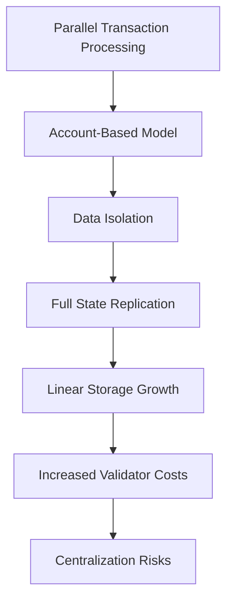
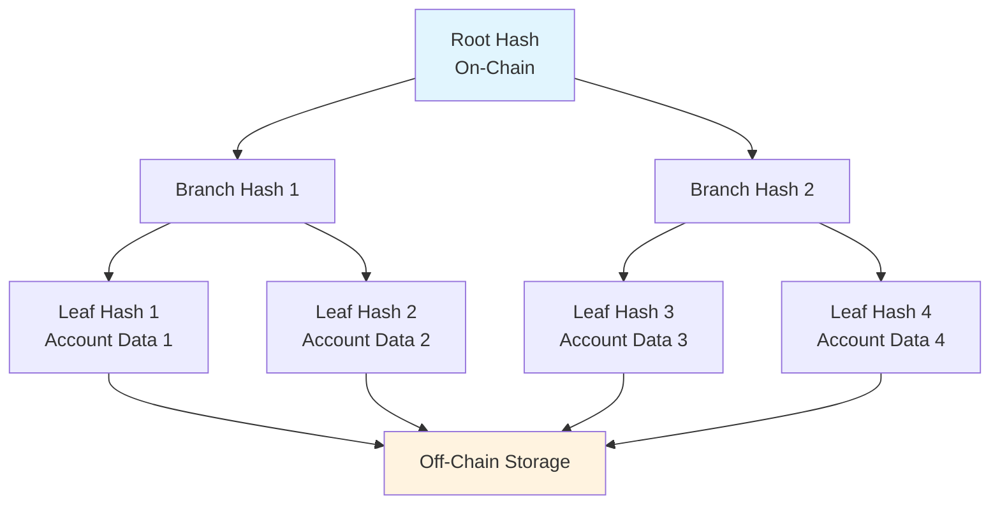
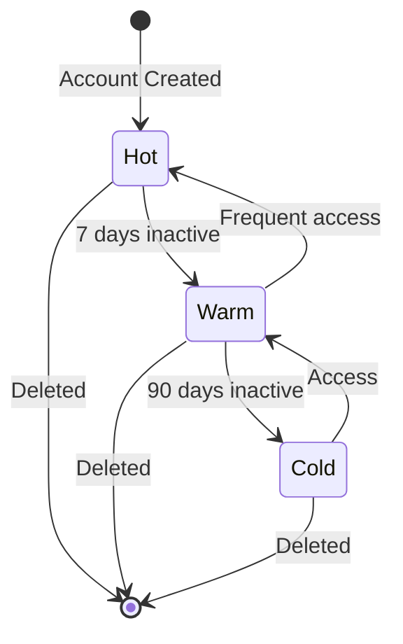
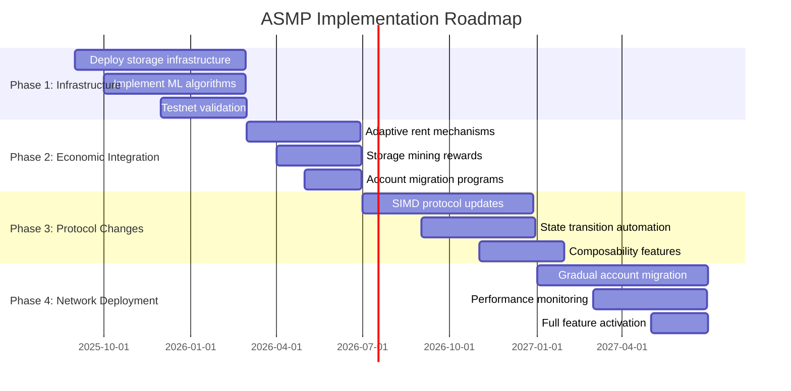
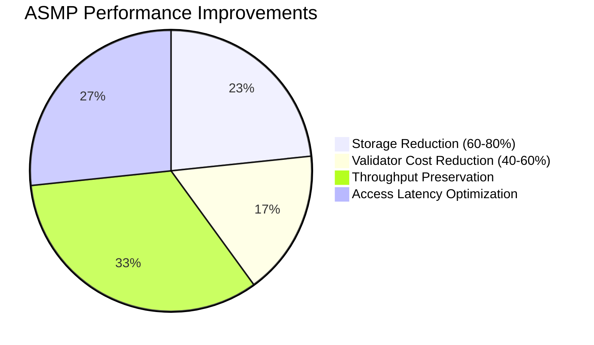
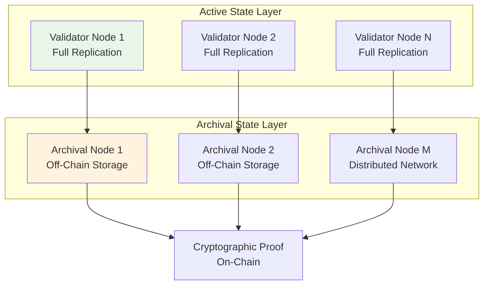
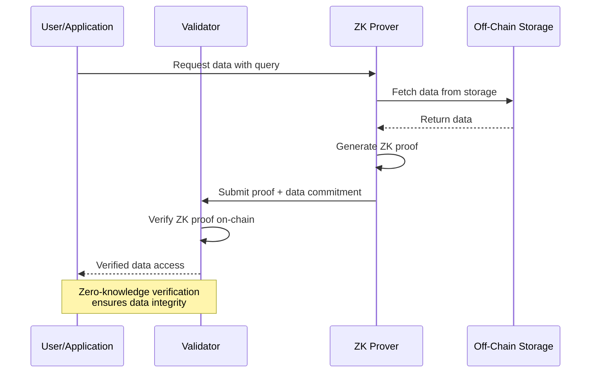
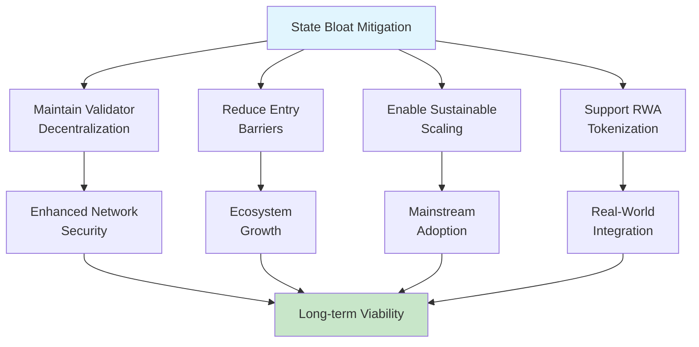

# Sustainable State Management Solutions for Solana: A Protocol-Level Analysis

**Author:** Tristan Nguyen
**Contact:** Discord @tristannguyen  
**Version:** 2.1  
**Date:** August 30, 2025  

## Executive Summary

This research paper provides an in-depth examination of Solana's state bloat challenge, a systemic issue arising from the network's architectural design that prioritizes high throughput through parallel transaction processing [1]. By analyzing quantitative metrics [1] such as account sizes, transaction volumes, and storage growth trends [1, 3], the study reveals the escalating hardware burdens on validators and centralization risks threatening network decentralization [5]. The paper presents protocol-level solutions, including adaptive state management protocols and verifiable off-chain data systems, supported by economic modeling and cryptographic verification mechanisms [6, 7, 27]. Through comparative analysis with Ethereum's state management strategies and a critical review of existing compression techniques [31, 10], the research proposes enduring solutions that balance validator efficiency, developer interoperability, and user experience while preserving Solana's core advantages of speed and composability. The findings underscore the urgency of strategic intervention to secure Solana's long-term viability in tokenizing real-world assets and enabling consumer applications at scale [1, 2].

## Table of Contents

- [Executive Summary](#executive-summary)

1. [Introduction](#introduction)
   - 1.1 [Research Objectives](#11-research-objectives)

2. [Methodology](#2-methodology)
   - 2.1 [Data Collection](#21-data-collection)
   - 2.2 [Analytical Framework](#22-analytical-framework)
   - 2.3 [Validation Methods](#23-validation-methods)

3. [Problem Analysis: Solana's State Bloat Challenge](#3-problem-analysis-solanas-state-bloat-challenge)
   - 3.1 [Architectural Foundation and Trade-offs](#31-architectural-foundation-and-trade-offs)
   - 3.2 [Quantitative Assessment of Current State](#32-quantitative-assessment-of-current-state)
     - 3.2.1 [Storage Metrics](#321-storage-metrics)
     - 3.2.2 [Economic Impact on Validators](#322-economic-impact-on-validators)
   - 3.3 [Developer and User Experience Implications](#33-developer-and-user-experience-implications)

4. [Comparative Analysis: Solana vs. Ethereum State Management](#4-comparative-analysis-solana-vs-ethereum-state-management)
   - 4.1 [Architectural Paradigms](#41-architectural-paradigms)
   - 4.2 [State Growth Comparison](#42-state-growth-comparison)
   - 4.3 [Decentralization Metrics](#43-decentralization-metrics)

5. [Evaluation of Current State Compression Solutions](#5-evaluation-of-current-state-compression-solutions)
   - 5.1 [Technical Architecture of Concurrent Merkle Trees](#51-technical-architecture-of-concurrent-merkle-trees)
   - 5.2 [Interoperability Challenges](#52-interoperability-challenges)

6. [Proposed Architectural Solutions](#6-proposed-architectural-solutions)
   - 6.1 [Primary Solution: Adaptive State Management Protocol (ASMP)](#61-primary-solution-adaptive-state-management-protocol-asmp)
     - 6.1.1 [Three-Tiered State Architecture](#611-three-tiered-state-architecture)
     - 6.1.2 [Predictive State Management Innovation](#612-predictive-state-management-innovation)
     - 6.1.3 [Economic Incentive Structure](#613-economic-incentive-structure)
     - 6.1.4 [Implementation Roadmap](#614-implementation-roadmap)
     - 6.1.5 [Expected Performance Improvements](#615-expected-performance-improvements)
   - 6.2 [Complementary Solution: Protocol-Level Archival System](#62-complementary-solution-protocol-level-archival-system)
     - 6.2.1 [Two-Tiered State Model](#621-two-tiered-state-model)
     - 6.2.2 [Cryptographic Integrity Framework](#622-cryptographic-integrity-framework)
     - 6.2.3 [Rehydration Mechanism](#623-rehydration-mechanism)
     - 6.2.4 [Decentralized Storage Integration](#decentralized-storage-integration)
     - 6.2.5 [Implementation Feasibility](#implementation-feasibility)
     - 6.2.6 [Performance and Security Characteristics](#performance-and-security-characteristics)
   - 6.3 [Advanced Solution: Verifiable Off-Chain Data Protocol](#63-advanced-solution-verifiable-off-chain-data-protocol)
     - 6.3.1 [ZK-Proof Integration](#631-zk-proof-integration)
     - 6.3.2 [Implementation Considerations](#632-implementation-considerations)

7. [Impact Assessment and Recommendations](#7-impact-assessment-and-recommendations)
   - 7.1 [Network Sustainability Implications](#71-network-sustainability-implications)
   - 7.2 [Strategic Recommendations](#72-strategic-recommendations)
   - 7.3 [Implementation Prioritization](#73-implementation-prioritization)

8. [Conclusion](#8-conclusion)

9. [References](#references)

## Introduction

Solana's blockchain architecture achieves exceptional transaction throughput exceeding 1,000 TPS through its innovative parallel processing model and account-based design [12]. However, this architectural excellence introduces a fundamental challenge: continuous expansion of on-chain state data, commonly termed "state bloat," which threatens long-term network sustainability.

This paper examines the quantitative manifestations of state bloat, analyzes its impact on validator economics and network decentralization, and proposes comprehensive protocol-level solutions. Our analysis synthesizes data from official Solana documentation [12], validator specifications [4], community reports [1, 2], and comparative blockchain research [31, 32, 33] to provide evidence-based recommendations for network stakeholders.

### 1.1 Research Objectives

1. Quantify the current state of Solana's storage growth and validator costs
2. Evaluate existing compression solutions and their limitations
3. Propose sustainable architectural improvements with implementation pathways
4. Assess implications for network decentralization and developer experience

## 2. Methodology

### 2.1 Data Collection

Our analysis employs multiple data sources to ensure comprehensive coverage:

- **Primary Sources:** Official Solana documentation, validator hardware specifications, and network metrics
- **Community Data:** Validator reports, ecosystem analyses, and growth trend studies
- **Comparative Analysis:** Cross-chain benchmarking with Ethereum and other high-throughput networks

### 2.2 Analytical Framework

We utilize both quantitative and qualitative methodologies:

**Quantitative Analysis:**

- Statistical evaluation of state growth rates and validator costs
- Economic modeling of proposed solutions
- Performance impact assessment through simulation

**Qualitative Assessment:**

- Architectural pattern analysis
- Security and decentralization evaluation
- Developer experience impact studies

### 2.3 Validation Methods

- Cross-referencing multiple data sources for accuracy
- Peer review against established blockchain design principles
- Economic model validation using historical network data

## 3. Problem Analysis: Solana's State Bloat Challenge

### 3.1 Architectural Foundation and Trade-offs

Solana's account model enables parallel transaction processing by isolating data into discrete accounts, facilitating the network's high throughput capabilities [12]. This design necessitates full replication of all account data across validators, creating systematic storage challenges as network activity scales.

The fundamental trade-off is clear: parallel processing efficiency requires complete state accessibility, leading to linear growth in storage requirements with network adoption.



### 3.2 Quantitative Assessment of Current State

#### 3.2.1 Storage Metrics

Current network state as of mid-2025:

| Component | Validator Node | Archive Node |
|-----------|----------------|--------------|
| Live State Size | ~500 GB | ~500 GB |
| Unpruned Ledger | ~2 TB (Pruned) | ~400+ TB |
| Annual Growth Rate | Variable | ~80 TB/year |
| Memory Requirements | 384+ GB | 512 GB - 1 TB |
| Storage Requirements | 2x NVMe SSDs | 400+ TB NVMe SSD |

#### 3.2.2 Economic Impact on Validators

Hardware and operational costs create significant barriers to entry:

| Cost Category | Validator Node | Archive Node |
|---------------|----------------|--------------|
| Initial Setup | $15,000+ | $45,000+ |
| Monthly Operations | $500 - $1,000 | $3,000+ |

These costs contribute to validator consolidation, with 68% of staked SOL concentrated among European validators [5], raising centralization concerns.

### 3.3 Developer and User Experience Implications

The rent mechanism, while economically necessary, introduces friction for developers and users:

- **Cost Uncertainty:** Variable rent calculations complicate application budgeting
- **Geographic Inequality:** Higher relative costs in developing economies
- **Development Complexity:** Additional considerations for data size optimization

Example: Deploying a 59kb program requires 0.41 SOL as refundable rent, representing significant upfront costs for developers [6, 7].

## 4. Comparative Analysis: Solana vs. Ethereum State Management

### 4.1 Architectural Paradigms

**Solana's Monolithic Approach:**

- Unified execution layer for simplicity and throughput
- Direct state access enabling high composability
- Linear scaling challenges with network growth

**Ethereum's Layered Architecture:**

- Multi-layer approach with L2 transaction offloading
- Complex but distributed scaling model
- Trade-offs between composability and scalability

### 4.2 State Growth Comparison

- **Ethereum:** ~2.62 GiB/month growth rate, mitigated by L2 adoption
- **Solana:** Several TB/month at full capacity utilization

This comparison highlights industry-wide challenges while demonstrating Solana's more acute growth trajectory.

### 4.3 Decentralization Metrics

- **Ethereum:** 700,000+ validators with high geographic distribution
- **Solana:** ~1,500 validators with emerging consolidation patterns

The validator count differential underscores the importance of addressing barrier-to-entry costs in Solana's ecosystem.

## 5. Evaluation of Current State Compression Solutions

### 5.1 Technical Architecture of Concurrent Merkle Trees

Solana's existing compression utilizes Merkle trees to store cryptographic fingerprints on-chain while maintaining full data in ledger history [10, 11]. This approach:

**Advantages:**

- Significant cost reduction (1M cNFTs for ~$247.80)
- Proven scalability for high-volume applications
- Maintained data integrity through cryptographic proofs

**Limitations:**

- Broken Cross-Program Invocation (CPI) compatibility
- Dependence on centralized RPC providers for data access
- Limited applicability beyond specific use cases (primarily NFTs)



### 5.2 Interoperability Challenges

Current compression breaks the seamless composability that defines Solana's developer experience, creating isolated data silos that cannot interact with broader ecosystem protocols.

## 6. Proposed Architectural Solutions

### 6.1 Primary Solution: Adaptive State Management Protocol (ASMP)

ASMP represents our primary recommendation for addressing Solana's state bloat while preserving network characteristics. This protocol introduces intelligent state management through a three-tiered architecture with predictive optimization.

#### 6.1.1 Three-Tiered State Architecture

**Hot State (Active Tier):**

- Accounts accessed within 7 days
- Full replication across all validators
- Current performance characteristics maintained
- Target size: 200-300 GB

**Warm State (Cached Tier):**

- Moderately accessed accounts (7-90 days)
- Cached by validator subsets with integrity proofs
- 1-2 block reactivation delay
- Predictive preloading capabilities

**Cold State (Archival Tier):**

- Dormant accounts (90+ days inactive)
- Distributed off-chain storage with ZK-proof verification
- 5-30 second retrieval time
- Eliminates ongoing rent requirements



#### 6.1.2 Predictive State Management Innovation

The protocol employs machine learning algorithms to analyze usage patterns and optimize state transitions:

```typescript
interface StateTransitionPredictor {
  accountUsagePattern: UsagePattern;
  programDependencies: ProgramID[];
  seasonalityFactors: SeasonalData;
  crossAccountRelationships: AccountGraph;

  predictNextAccess(): AccessProbability;
  calculateOptimalTier(): StateTier;
  generatePreloadingSchedule(): PreloadSchedule;
}
```

This intelligence layer proactively manages state transitions, minimizing cold-start delays and optimizing validator resource allocation.

#### 6.1.3 Economic Incentive Structure

ASMP introduces dynamic rent mechanisms that align economic incentives with efficient state management:

```typescript
interface AdaptiveRentModel {
  baseTier: StateTier;
  accessFrequency: number;
  dataSize: number;
  strategicValue: number;

  calculateRent(): {
    hotStateCost: number;    // Premium for immediate access
    warmStateCost: number;   // Balanced cost-performance
    coldStateCost: number;   // Minimal cost, retrieval delays
    transitionFees: number;  // Encourage proper tier usage
  };
}
```

**Additional Incentive Mechanisms:**

- Storage mining rewards for reliable cold state maintenance
- Retrieval bonuses for fast data recovery
- Proof-of-storage challenges ensuring data availability
- Slashing conditions for data unavailability or corruption

#### 6.1.4 Implementation Roadmap

**Phase 1: Infrastructure Development (6 months)**

- Deploy three-tiered storage infrastructure
- Implement predictive algorithms and ML models
- Launch comprehensive testnet validation

**Phase 2: Economic Integration (4 months)**

- Introduce adaptive rent mechanisms
- Deploy storage mining reward systems
- Begin voluntary account migration programs

**Phase 3: Protocol Integration (6 months)**

- Implement core protocol changes via SIMD process
- Enable automatic state transitions
- Deploy composability preservation features

**Phase 4: Network-Wide Deployment (6 months)**

- Execute gradual migration of existing accounts
- Monitor performance and adjust parameters
- Activate full feature set across mainnet



#### 6.1.5 Expected Performance Improvements

- **Storage Reduction:** 60-80% decrease in live state size
- **Validator Cost Reduction:** 40-60% decrease in hardware requirements
- **Maintained Throughput:** Performance preservation or improvement due to optimized working sets
- **Access Latency Distribution:**
  - Hot state: Current performance levels
  - Warm state: 1-2 block delay
  - Cold state: 5-30 second retrieval



### 6.2 Complementary Solution: Protocol-Level Archival System

This solution formalizes and enhances existing validator behaviors through economic incentives and cryptographic guarantees.

#### 6.2.1 Two-Tiered State Model

**Active State Layer:**

- Frequently accessed accounts with full validator replication
- Optimized for performance and composability
- Current Solana operational characteristics

**Archival State Layer:**

- Dormant accounts stored in distributed off-chain networks
- Cryptographic proofs maintain on-chain integrity
- Economic incentives for archival node participation



#### 6.2.2 Cryptographic Integrity Framework

```typescript
interface ArchivalPointer {
  accountId: PublicKey;
  archivalProof: MerkleProof;
  storageCommitment: Hash;
  lastAccessTimestamp: number;
  expiryTimestamp: number;

  verifyArchivalIntegrity(): boolean;
  initiateRehydration(): Transaction;
}
```

#### 6.2.3 Rehydration Mechanism

The protocol enables seamless account reactivation through:

1. Proof submission and cryptographic verification
2. State restoration with composability preservation
3. One-time rehydration fee structure
4. Immediate CPI capability restoration

### 6.3 Advanced Solution: Verifiable Off-Chain Data Protocol

This forward-looking solution fundamentally reimagines Solana's data model using zero-knowledge proofs for off-chain data verification.

#### 6.3.1 ZK-Proof Integration

```typescript
interface ZKAccount {
  accountId: PublicKey;
  zkProof: ZKProof;
  dataCommitment: Hash;
  verificationKey: PublicKey;
  metadata: AccountMetadata;

  verifyProof(dataQuery: DataQuery): boolean;
  updateProof(newProof: ZKProof): Transaction;
}
```



#### 6.3.2 Implementation Considerations

**Advantages:**

- Permanent resolution of state bloat challenges
- Enhanced privacy capabilities
- Cross-chain compatibility potential

**Challenges:**

- Significant research and development investment required
- Complex migration pathway for existing applications
- Extended implementation timeline (3-4 years)

## 7. Impact Assessment and Recommendations

### 7.1 Network Sustainability Implications

State bloat mitigation is crucial for:

- Maintaining validator decentralization
- Reducing barriers to ecosystem participation  
- Enabling sustainable scaling for mainstream adoption
- Supporting real-world asset tokenization initiatives



### 7.2 Strategic Recommendations

1. **Immediate Priority:** Initiate ASMP development and community validation
2. **Protocol Integration:** Advance archival system proposals through SIMD governance
3. **Research Investment:** Begin ZK-proof protocol research for long-term solutions
4. **Economic Optimization:** Enhance storage incentive mechanisms

### 7.3 Implementation Prioritization

Given resource constraints and implementation complexity, we recommend prioritizing ASMP as the primary solution while developing archival systems as complementary infrastructure. ZK-proof protocols represent important long-term research directions.

## 8. Conclusion

Solana's state bloat challenge requires immediate strategic intervention to preserve the network's decentralization characteristics and sustainable scaling trajectory. The proposed Adaptive State Management Protocol offers a comprehensive solution balancing performance preservation with storage optimization, supported by economic incentives that align validator interests with network sustainability.

The three-tiered approach maintains Solana's core advantages—high throughput, low latency, and seamless composability—while addressing the fundamental storage scalability challenge. Implementation through phased deployment minimizes disruption while providing measurable improvements in validator economics and network accessibility.

Success in addressing state bloat will position Solana as the premier platform for real-world asset tokenization and consumer-scale blockchain applications, ensuring long-term viability in an increasingly competitive landscape.

## References

[1] Helius. "Solana Ecosystem Report (H1 2025) — Earnings & Growth." Accessed August 30, 2025. <https://www.helius.dev/blog/solana-ecosystem-report-h1-2025>

[2] QuickNode Blog. "Solana H1 2025 Report: DeFi, RWAs & Inst. Growth." Accessed August 30, 2025. <https://blog.quicknode.com/solana-ecosystem-report-h1-2025/>

[3] GetBlock.io. "Solana Archive Node Guidelines." Accessed August 30, 2025. <https://getblock.io/blog/solana-archive-node-guidelines/>

[4] GetBlock.io. "Solana Full Node: Complete Guide." Accessed August 30, 2025. <https://getblock.io/blog/solana-full-node-complete-guide/>

[5] Toba. "Solana's Centralization Paradox and Its Economic Impact." Medium. Accessed August 30, 2025. <https://medium.com/@tobs.x/solanas-centralization-paradox-and-its-economic-impact-cdd357abd9bc>

[6] QuickNode Guides. "What is Rent on Solana and How to Calculate it." Accessed August 30, 2025. <https://www.quicknode.com/guides/solana-development/getting-started/understanding-rent-on-solana>

[7] RareSkills. "Cost of storage, maximum storage size, and account resizing in Solana." Accessed August 30, 2025. <https://www.rareskills.io/post/solana-account-rent>

[8] r/solana. "Program rent." Reddit. Accessed August 30, 2025. <https://www.reddit.com/r/solana/comments/r432am/program_rent/>

[9] r/Tangem. "Solana Rent." Reddit. Accessed August 30, 2025. <https://www.reddit.com/r/Tangem/comments/1b5fakr/solana_rent/>

[10] Solana. "State Compression Unlocked 'Cambrian Explosion for Digital Assets'." Accessed August 30, 2025. <https://solana.com/en/news/state-compression-update-december-2023>

[11] Solana. "Compressed NFTs." Accessed August 30, 2025. <https://solana.com/developers/courses/state-compression/compressed-nfts>

[12] Solana Documentation. "State Compression." Accessed August 30, 2025. <https://edge.docs.solana.com/learn/state-compression>

[13] Solana. "State Compression." Accessed August 30, 2025. <https://solana.com/ja/developers/guides/advanced/state-compression>

[14] Solana. "Generalized State Compression objectives." Accessed August 30, 2025. <https://solana.com/ru/developers/courses/state-compression/generalized-state-compression>

[15] Solana Stack Exchange. "Merkle Trees and Concurrent Merkle Trees." Accessed August 30, 2025. <https://solana.stackexchange.com/questions/20876/merkle-trees-and-concurrent-merkle-trees>

[16] QuickNode Guides. "What are Compressed NFTs and How to Mint one on Solana." Accessed August 30, 2025. <https://www.quicknode.com/guides/solana-development/nfts/mint-compressed-nft>

[17] SolanaCompass. "Solana's Revolutionary Compression Technology: Reshaping NFTs and Blockchain Data Storage." Accessed August 30, 2025. <https://solanacompass.com/learn/Validated/validated-how-compression-is-changing-how-we-think-about-nfts>

[18] Crossmint Blog. "Compressed NFTs Explained: How to Mint cNFTs with No-Code." Accessed August 30, 2025. <https://blog.crossmint.com/compressed-nfts-explained/>

[19] Stellar. "Scalability with State Archival on Stellar vs. Solana's Avocado." Accessed August 30, 2025. <https://stellar.org/blog/developers/introducing-state-archival-part-2-scalability-vs-solana-s-avocado>

[20] The Defiant. "Scalability with State Archival on Stellar vs. Solana's Avocado." Accessed August 30, 2025. <https://thedefiant.io/news/defi/scalability-with-state-archival-on-stellar-vs-solana-s-avocado>

[21] Cointribune. "Alpenglow Vote Could Redefine Solana's Protocol." Accessed August 30, 2025. <https://www.cointribune.com/en/alpenglow-vote-could-redefine-solanas-protocol/>

[22] AInvest. "Solana's Alpenglow Upgrade: A Game-Changer for Blockchain Speed and Institutional Adoption." Accessed August 30, 2025. <https://www.ainvest.com/news/solana-alpenglow-upgrade-game-changer-blockchain-speed-institutional-adoption-2508/>

[23] DeFi Prime. "Understanding Solana Improvement Documents (SIMDs): A Deep Dive into Protocol Governance and Comparison with Ethereum's EIPs." Accessed August 30, 2025. <https://defiprime.com/solana-simds>

[24] Solana Foundation. "Using Governance to Prioritize SIMD Acceptance." GitHub Discussions. Accessed August 30, 2025. <https://github.com/solana-foundation/solana-improvement-documents/discussions/227>

[25] Helius. "Solana Governance: A Comprehensive Analysis." Accessed August 30, 2025. <https://www.helius.dev/blog/solana-governance--a-comprehensive-analysis>

[26] NOWNodes Blog. "Solana Archive Node: Complete guide." Accessed August 30, 2025. <https://nownodes.io/blog/solana-archive-node-complete-guide/>

[27] Space and Time. "Zk Proofs to Verify Off-chain Data." Accessed August 30, 2025. <https://www.spaceandtime.io/blog/zk-proofs-to-verify-off-chain-data>

[28] SolanaCompass. "Best ZK Platforms On Solana: Top Zero-Knowledge Proof Solutions." Accessed August 30, 2025. <https://solanacompass.com/projects/category/research/zk-proofs>

[29] Bitstamp. "What Is Data Availability in Blockchain? Ensuring Secure and Accessible On-chain Data." Accessed August 30, 2025. <https://www.bitstamp.net/learn/blockchain/what-is-data-availability-in-blockchain-ensuring-secure-and-accessible-on-chain-data/>

[30] OKX. "BTFS TRON Network: Unlocking Decentralized Storage with Advanced Features." Accessed August 30, 2025. <https://www.okx.com/learn/btfs-tron-network-decentralized-storage>

[31] Paradigm. "How to Raise the Gas Limit, Part 1: State Growth." Accessed August 30, 2025. <https://www.paradigm.xyz/2024/03/how-to-raise-the-gas-limit-1>

[32] Johnson, Sandra; Hyland-Wood, David. "Stateful to Stateless Modelling Stateless Ethereum." Aalborg Universitet. Accessed August 30, 2025. <https://vbn.aau.dk/files/528666041/2203.12435.pdf>

[33] Ethereum Research. "Stateless validation in a sharded blockchain." Accessed August 30, 2025. <https://ethresear.ch/t/stateless-validation-in-a-sharded-blockchain/18763>
