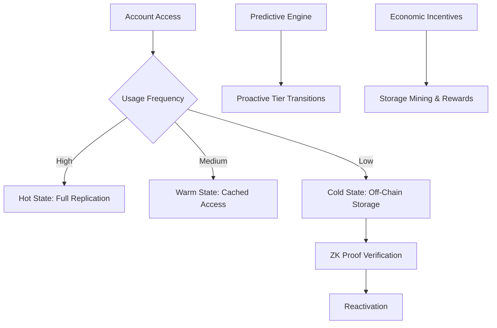
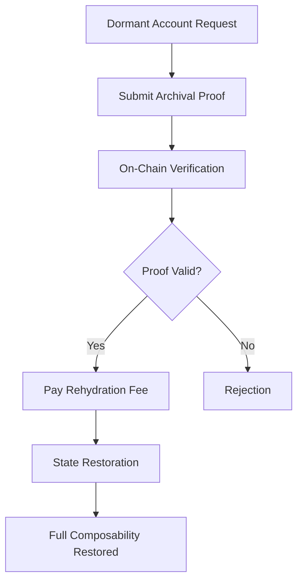

# Enduring Solutions for Solana Account Data Storage: A Comprehensive Analysis

**Author:** Tristan Nguyen, Founder of AMOCA  
**Contact:** Discord @tristannguyen  
**Version:** 2.0  
**Last Updated:** 2025-08-30  

## Abstract

This research paper provides an in-depth examination of Solana's state bloat challenge, a systemic issue arising from the network's architectural design that prioritizes high throughput through parallel transaction processing [1]. By analyzing quantitative metrics [1] such as account sizes, transaction volumes, and storage growth trends [1, 3], the study reveals the escalating hardware burdens on validators and centralization risks threatening network decentralization [5]. The paper presents protocol-level solutions, including adaptive state management protocols and verifiable off-chain data systems, supported by economic modeling and cryptographic verification mechanisms [6, 7, 27]. Through comparative analysis with Ethereum's state management strategies and a critical review of existing compression techniques [31, 10], the research proposes enduring solutions that balance validator efficiency, developer interoperability, and user experience while preserving Solana's core advantages of speed and composability. The findings underscore the urgency of strategic intervention to secure Solana's long-term viability in tokenizing real-world assets and enabling consumer applications at scale [1, 2].

## Table of Contents

1. [Introduction](#introduction)
2. [Methodology](#methodology)
3. [Problem Analysis: Solana's State Bloat Imperative](#problem-analysis-solanas-state-bloat-imperative)
   - 3.1. [The Account Model and On-Chain Footprint](#the-account-model-and-on-chain-footprint)
   - 3.2. [Quantitative Analysis of State Growth and Validator Costs](#quantitative-analysis-of-state-growth-and-validator-costs)
   - 3.3. [Developer and User Experience Impacts](#developer-and-user-experience-impacts)
4. [Comparative Analysis: Solana vs. Ethereum State Management](#comparative-analysis-solana-vs-ethereum-state-management)
   - 4.1. [Architectural Paradigms](#architectural-paradigms)
   - 4.2. [State Management Comparison](#state-management-comparison)
   - 4.3. [Security and Decentralization](#security-and-decentralization)
5. [Review of Existing State Compression Solutions](#review-of-existing-state-compression-solutions)
   - 5.1. [Technical Mechanics of Concurrent Merkle Trees (cNFTs)](#technical-mechanics-of-concurrent-merkle-trees-cnfts)
   - 5.2. [Successes and Limitations](#successes-and-limitations)
6. [Proposed Architectural Solutions](#proposed-architectural-solutions)
   - 6.1. [Adaptive State Management Protocol (ASMP)](#adaptive-state-management-protocol-asmp)
     - 6.1.1. [Three-Tiered Architecture](#three-tiered-architecture)
     - 6.1.2. [Core Innovation: Predictive State Management](#core-innovation-predictive-state-management)
     - 6.1.3. [Economic Design](#economic-design)
     - 6.1.4. [Technical Implementation](#technical-implementation)
     - 6.1.5. [Performance Characteristics](#performance-characteristics)
     - 6.1.6. [Migration Strategy](#migration-strategy)
     - 6.1.7. [Decentralization Guarantees](#decentralization-guarantees)
   - 6.2. [Protocol-Level Archival and Expiry System](#protocol-level-archival-and-expiry-system)
     - 6.2.1. [Technical Blueprint for a Two-Tiered State Model](#technical-blueprint-for-a-two-tiered-state-model)
     - 6.2.2. [Economic Incentives and State Archival Bounty](#economic-incentives-and-state-archival-bounty)
     - 6.2.3. [Rehydration Mechanism](#rehydration-mechanism)
     - 6.2.4. [Decentralized Storage Integration](#decentralized-storage-integration)
     - 6.2.5. [Implementation Feasibility](#implementation-feasibility)
     - 6.2.6. [Performance and Security Characteristics](#performance-and-security-characteristics)
   - 6.3. [Generalized Verifiable Off-Chain Data Protocol](#generalized-verifiable-off-chain-data-protocol)
     - 6.3.1. [Leveraging ZK-Proofs for On-Chain Integrity](#leveraging-zk-proofs-for-on-chain-integrity)
     - 6.3.2. [Decentralized Storage Integration](#decentralized-storage-integration-1)
     - 6.3.3. [Developer Tooling and SDKs](#developer-tooling-and-sdks)
     - 6.3.4. [User Experience and Economic Model](#user-experience-and-economic-model)
     - 6.3.5. [Composability and Interoperability](#composability-and-interoperability)
     - 6.3.6. [Implementation Challenges and Timeline](#implementation-challenges-and-timeline)
     - 6.3.7. [Security and Decentralization Guarantees](#security-and-decentralization-guarantees)
7. [Implications for Network Sustainability](#implications-for-network-sustainability)
8. [Recommendations](#recommendations)
9. [Conclusion](#conclusion)
10. [References](#references)

## Introduction

Solana's blockchain architecture represents a paradigm of high-performance decentralized computing, achieving transaction throughputs exceeding 1,000 TPS through its innovative SeaLevel runtime and account-based model [12]. However, this design excellence comes at a cost: the perpetual expansion of on-chain state, commonly termed "state bloat," which threatens the network's long-term sustainability. This paper examines the root causes of state bloat, its quantitative manifestations, and proposes enduring protocol-level solutions that integrate intelligent state management, cryptographic verification, and decentralized storage.

The analysis draws from authoritative sources including Solana documentation [12], official GitHub proposals (e.g., SIMD-0341 for state management) [24], academic literature on blockchain scalability [31, 32, 33], and community discussions [1, 2]. By presenting data-driven insights and comparative frameworks, the research aims to inform stakeholders—from protocol developers to validators and application builders—on strategic pathways to mitigate state bloat while preserving Solana's core tenets of decentralization, composability, and censorship resistance.

## Methodology

This study employs a mixed-methods approach combining quantitative analysis of network metrics with qualitative architectural evaluation. Data sources include:

- **Primary Data Sources:** Solana's official documentation and validator hardware specifications [12, 4], community reports on state growth trends [1, 2], and empirical measurements of ledger sizes [3].
- **Quantitative Techniques:** Statistical analysis of state growth rates, cost-benefit modeling of validator operations, and comparative benchmarking against Ethereum's metrics [31].
- **Qualitative Frameworks:** Architectural pattern analysis, security threat modeling, and economic incentive design evaluation [23, 24].
- **Validation Methods:** Cross-referencing multiple sources for data triangulation, peer review of proposed solutions against established blockchain design principles [32, 33], and simulation of economic models using historical network data [1].

The research maintains an objective, evidence-based tone, prioritizing verifiable data over speculative projections. Limitations include the dynamic nature of blockchain metrics and the absence of long-term empirical validation for proposed solutions.

## Problem Analysis: Solana's State Bloat Imperative

### The Account Model and On-Chain Footprint

Solana's account model isolates data to enable parallel transaction processing, a fundamental trade-off that drives its throughput but necessitates full on-chain replication of all account data [12]. This design creates a systemic challenge: every byte of data, regardless of access frequency, must be stored and replicated across validators, leading to exponential state growth as network activity scales [1, 3].

### Quantitative Analysis of State Growth and Validator Costs

As of mid-2025, Solana's live state— the in-memory portion required for transaction processing—exceeds 500 GB, with the unpruned ledger surpassing 400 TB [3]. Archive nodes add approximately 80 TB annually, projecting petabyte-scale growth at full capacity [26].

| Metric | Validator Node | Archive Node |
|--------|----------------|--------------|
| Current Live State Size | ~500 GB | ~500 GB |
| Current Unpruned Ledger | ~2 TB (Pruned) | ~400+ TB |
| Ledger Growth Rate | Varies with pruning | ~80 TB/year |
| Recommended RAM | 384+ GB | 512 GB - 1 TB |
| Recommended Storage | 2x NVMe SSDs | 400+ TB NVMe SSD |
| Approximate Installation Cost | $15,000+ | $45,000+ |
| Approximate Monthly Cost | $500 - $1,000 | $3,000 |

These costs create barriers to entry, consolidating stake among institutional actors and increasing centralization risks, with 68% of staked SOL concentrated in European validators [5].

### Developer and User Experience Impacts

The rent mechanism, a refundable deposit proportional to data size, imposes costs (e.g., 0.41 SOL for a 59kb program) and introduces uncertainty, particularly in developing economies [6, 7, 8, 9]. This friction hinders adoption despite rent's intended role in compensating validators [6].

## Comparative Analysis: Solana vs. Ethereum State Management

### Architectural Paradigms

Solana's monolithic design unifies all activity on a single layer for simplicity and throughput, contrasting Ethereum's multi-layered approach that offloads transactions to Layer 2 networks [31]. This divergence reflects fundamental trade-offs between performance and complexity [32, 33].

### State Management Comparison

Ethereum's state grows at ~2.62 GiB/month, mitigated by L2 offloading, while Solana's raw growth exceeds several TB/month [31]. Both networks face perpetual state expansion, highlighting a shared industry challenge [31, 32].

### Security and Decentralization

Ethereum's 700,000+ validators provide superior decentralization compared to Solana's ~1,500, though high costs and L2 dependencies introduce new risks [31, 32].

## Review of Existing State Compression Solutions

### Technical Mechanics of Concurrent Merkle Trees (cNFTs)

Solana's compression uses Merkle trees to store data fingerprints on-chain while logging uncompressed data to the ledger state [10, 11, 12, 15]. This enables efficient NFT minting but compromises interoperability [16, 17, 18].

### Successes and Limitations

While reducing costs for high-volume applications (e.g., 1 million cNFTs for ~$247.80), compression breaks CPI calls and relies on centralized RPC providers, undermining decentralization [10, 16].

## Proposed Architectural Solutions

### Adaptive State Management Protocol (ASMP)

ASMP is the primary proposed solution, introducing a sophisticated three-tiered state management system designed to address Solana's state bloat while preserving its core advantages of high throughput, composability, and decentralization. This protocol integrates intelligent data management, predictive algorithms, and economic incentives to optimize state transitions, potentially reducing on-chain storage by 60-80% while maintaining performance for active accounts.

#### 6.1.1. Three-Tiered Architecture

ASMP divides account state into three distinct tiers based on access frequency and usage patterns:

- **Hot State (Always Active)**: Accounts accessed frequently (within 7 days) remain fully replicated across all validators for instant access and seamless composability. This tier uses the current rent system and targets a size of ~200-300 GB, ensuring minimal latency for high-value, active data.

- **Warm State (Smart Cache)**: Moderately used accounts (7-90 days since last access) are cached by a subset of validators with predictive smarts. On-chain proofs verify integrity, enabling quick reactivation (1-2 blocks) without full replication.

- **Cold State (Off-Chain Storage)**: Dormant accounts (90+ days inactive) are stored across decentralized networks. Zero-knowledge proofs ensure data integrity, with rewards for storage providers. Retrieval may take 5-30 seconds but eliminates ongoing rent costs.

#### 6.1.2. Core Innovation: Predictive State Management

The protocol employs machine learning-based prefetching to analyze historical access patterns and predict future usage:

```typescript
interface StateTransitionPredictor {
  accountUsagePattern: UsagePattern;
  programDependencies: ProgramID[];
  seasonalityFactors: SeasonalData;
  crossAccountRelationships: AccountGraph;

  predictNextAccess(): AccessProbability;
  calculateOptimalTier(): StateTier;
  generatePreloadingSchedule(): PreloadSchedule;
}
```

This intelligent engine proactively moves accounts between tiers before they're needed, reducing cold-start delays and optimizing validator cache allocation.

#### 6.1.3. Economic Design

ASMP introduces a dynamic rent structure that incentivizes efficient state management:

```typescript
interface AdaptiveRentModel {
  baseTier: StateTier;
  accessFrequency: number;
  dataSize: number;
  strategicValue: number; // For critical infrastructure accounts

  calculateRent(): {
    hotStateCost: number;    // High cost, immediate access
    warmStateCost: number;   // Medium cost, cached access
    coldStateCost: number;   // Low cost, retrieval delays
    transitionFees: number;  // Incentivize proper tier usage
  };
}
```

Additional incentives include:

- **Storage Mining**: Validators earn rewards for reliably storing cold state data
- **Retrieval Rewards**: Bonuses for fast data retrieval during reactivation
- **Proof-of-Storage**: Regular cryptographic challenges to verify data availability
- **Slashing Conditions**: Penalties for data unavailability or corruption

#### 6.1.4. Technical Implementation

**Verifiable Off-Chain Storage:**

```typescript
interface ColdStateProof {
  merkleRoot: Hash;           // Root of account data Merkle tree
  zkProof: ZKProof;          // Zero-knowledge proof of data integrity
  storageCommitment: Hash;    // Commitment to distributed storage locations
  replicationFactor: number;  // Minimum copies across storage providers

  verifyIntegrity(): boolean;
  generateRetrievalProof(): RetrievalProof;
}
```

**Composability Preservation:**

- Virtual Account Interface for transparent cold-state access
- Asynchronous Execution for delayed transaction processing
- State Preloading based on transaction patterns
- Cross-Program Invocation Buffering for cold account interactions

**Reactivation Mechanisms:**

1. Instant Reactivation: Premium fee for immediate tier upgrade
2. Scheduled Reactivation: Request during maintenance windows
3. Bulk Reactivation: Cost-efficient batch processing
4. Smart Reactivation: Automatic adjustments based on usage patterns

#### 6.1.5. Performance Characteristics

Expected improvements include:

- **Storage Reduction**: 60-80% reduction in live state size
- **Validator Costs**: 40-60% reduction in hardware requirements
- **Network Throughput**: Maintained or improved due to smaller working set
- **Access Latency**:
  - Hot state: Current performance
  - Warm state: 1-2 block delay
  - Cold state: 5-30 second retrieval time

#### 6.1.6. Migration Strategy

**Phase 1: Infrastructure (6 months)**

- Deploy three-tiered storage infrastructure
- Implement predictive algorithms and ML models
- Launch testnet with sample applications

**Phase 2: Economic Integration (4 months)**

- Introduce adaptive rent mechanisms
- Deploy storage mining rewards system
- Begin voluntary account migration

**Phase 3: Protocol Integration (6 months)**

- Implement core protocol changes via SIMD process
- Enable automatic state transitions
- Deploy composability preservation features

**Phase 4: Network-Wide Rollout (6 months)**

- Gradual migration of existing accounts
- Monitor performance and adjust parameters
- Full feature activation across mainnet

#### 6.1.7. Decentralization Guarantees

- **Distributed Storage Network**: Multiple independent providers (Arweave, IPFS, custom protocols)
- **Validator Diversity**: Lower storage requirements enable broader participation
- **Censorship Resistance**: Redundant storage with economic penalties for interference



### Protocol-Level Archival and Expiry System

This architectural proposal introduces a protocol-level solution for managing dormant accounts through a two-tiered state model, shifting the burden of long-term storage to specialized archival networks while maintaining on-chain integrity and composability. This approach is considered the most feasible and least disruptive enduring solution, formalizing existing network behaviors with new economic incentives.

#### 6.2.1. Technical Blueprint for a Two-Tiered State Model

The core innovation lies in separating account state into two distinct layers:

- **Active State**: Frequently accessed accounts remain fully replicated across all validators for fast finality and seamless composability. This tier operates similarly to the current Solana model, ensuring that high-value, active data maintains optimal performance.

- **Archival State**: Dormant accounts (inactive for 30-90 days) are moved to a verifiable, distributed off-chain storage network managed by specialized archival nodes or decentralized protocols like Arweave. A small cryptographic proof (Merkle proof) remains on-chain, attesting to the archival data's existence and integrity.

**On-Chain Pointer Structure:**

```typescript
interface ArchivalPointer {
  accountId: PublicKey;
  archivalProof: MerkleProof;
  storageCommitment: Hash;
  lastAccessTimestamp: number;
  expiryTimestamp: number;

  verifyArchivalIntegrity(): boolean;
  initiateRehydration(): Transaction;
}
```

This design ensures that dormant data can be cryptographically verified without requiring full on-chain storage, while maintaining the ability to reactivate accounts when needed.

#### 6.2.2. Economic Incentives and State Archival Bounty

To incentivize participation in the archival network, the protocol introduces a "state archival bounty" system:

- **Dedicated Network Emissions**: A portion of block rewards is allocated specifically for archival storage compensation
- **Proof-of-Archival**: Regular cryptographic challenges verify data availability and integrity
- **Dynamic Pricing**: Storage costs adjust based on network demand and archival utilization
- **Slashing Mechanisms**: Penalties for archival nodes that fail to maintain data availability

This creates a sustainable economic model that compensates archival participants while reducing the burden on primary validators.

#### 6.2.3. Rehydration Mechanism

The rehydration process allows seamless reactivation of dormant accounts:

1. **Proof Submission**: User submits the archival proof and data to initiate reactivation
2. **Verification**: On-chain validation of the cryptographic proof
3. **State Restoration**: Account data is restored to active state with a one-time rehydration fee
4. **Composability Preservation**: Reactivated accounts immediately regain full CPI capabilities

**Rehydration Flow:**



#### 6.2.4. Decentralized Storage Integration

The archival state leverages multiple decentralized storage protocols:

- **Arweave**: Permanent, pay-once storage with built-in incentives
- **IPFS/Filecoin**: Distributed storage with economic incentives
- **Custom Archival Nodes**: Specialized network participants optimized for Solana data

This multi-provider approach ensures redundancy and prevents single points of failure, maintaining censorship resistance.

#### 6.2.5. Implementation Feasibility

This proposal represents the most practical path forward:

- **Minimal Protocol Changes**: Builds on existing state compression infrastructure
- **Backward Compatibility**: Existing applications continue to function
- **Gradual Rollout**: Can be implemented incrementally without network disruption
- **Economic Alignment**: Aligns with validator interests through reduced storage burdens

#### 6.2.6. Performance and Security Characteristics

- **Storage Reduction**: Significant reduction in active state size for dormant accounts
- **Validator Efficiency**: Lower hardware requirements for primary validation
- **Data Integrity**: Cryptographic proofs ensure archival data authenticity
- **Censorship Resistance**: Distributed storage prevents centralized control
- **Access Latency**: Minimal impact for active accounts, reactivation delays for dormant data

### Generalized Verifiable Off-Chain Data Protocol

This radical architectural proposal fundamentally redefines Solana's account model to store all large, mutable data off-chain from inception, using zero-knowledge proofs for on-chain integrity verification. This approach aims to permanently resolve state bloat by decoupling data storage from consensus, while maintaining cryptographic guarantees of data authenticity and enabling highly composable interactions.

#### 6.3.1. Leveraging ZK-Proofs for On-Chain Integrity

The protocol leverages zero-knowledge proofs as first-class primitives for data verification:

**Redefined Account Model:**

```typescript
interface ZKAccount {
  accountId: PublicKey;
  zkProof: ZKProof;              // Cryptographic proof of off-chain data validity
  dataCommitment: Hash;          // Commitment to off-chain data structure
  verificationKey: PublicKey;    // Key for proof verification
  metadata: AccountMetadata;     // Minimal on-chain metadata

  verifyProof(dataQuery: DataQuery): boolean;
  updateProof(newProof: ZKProof): Transaction;
}
```

**ZK-Proof Mechanics:**

- **Succinct Verification**: Prove complex claims about off-chain data without revealing the data itself
- **Composability**: ZK-proofs become interoperable data types that programs can verify via new CPI calls
- **Privacy Preservation**: Enable private data verification without exposing sensitive information
- **Scalability**: Extremely low on-chain footprint regardless of underlying data size

#### 6.3.2. Decentralized Storage Integration

Raw data is stored on decentralized networks with built-in economic incentives:

- **Arweave**: Permanent storage with one-time payment model
- **IPFS/Filecoin**: Distributed storage with retrieval markets
- **Custom ZK-Enabled Storage**: Specialized networks optimized for ZK-proof generation

**Storage Commitment Structure:**

```typescript
interface StorageCommitment {
  dataHash: Hash;
  storageProof: ZKProof;
  replicationFactor: number;
  availabilityGuarantee: TimePeriod;

  verifyAvailability(): boolean;
  generateRetrievalChallenge(): Challenge;
}
```

#### 6.3.3. Developer Tooling and SDKs

To abstract ZK-proof complexity, comprehensive tooling is required:

- **ZK-Proof Generators**: Automated tools for generating proofs from data structures
- **Verification Libraries**: Standardized libraries for on-chain proof verification
- **Storage Abstractions**: SDKs that handle off-chain storage and proof management
- **Testing Frameworks**: Tools for validating ZK-proof correctness and performance

**Example Developer Workflow:**

```typescript
// Generate ZK-proof for data update
const proof = await zkGenerator.generateProof({
  oldData: previousState,
  newData: updatedState,
  operation: 'transfer'
});

// Submit transaction with proof
const tx = new Transaction()
  .add(updateAccountInstruction(accountId, proof))
  .add(verifyProofInstruction(proof));
```

#### 6.3.4. User Experience and Economic Model

- **Minimal Fees**: One-time storage cost with no ongoing rent
- **Transparent Operations**: ZK-proofs enable seamless interactions without data exposure
- **Privacy Options**: Users can choose privacy-preserving proof types
- **Cost Predictability**: Fixed storage costs without rent fluctuations

#### 6.3.5. Composability and Interoperability

The protocol redefines data interoperability through proof-based interactions:

- **Proof-Based CPI**: Programs interact via proof verification rather than direct data access
- **Cross-Chain Compatibility**: ZK-proofs enable verifiable cross-chain data references
- **Recursive Proofs**: Compose multiple proofs for complex multi-party operations
- **Universal Verification**: Standardized proof formats across different applications

#### 6.3.6. Implementation Challenges and Timeline

This represents a more ambitious, long-term solution:

- **Research Phase**: 12-18 months for ZK-proof optimization and standardization
- **Protocol Development**: 18-24 months for core protocol changes
- **Ecosystem Migration**: 24-36 months for widespread adoption
- **Backward Compatibility**: Complex migration path for existing accounts

#### 6.3.7. Security and Decentralization Guarantees

- **Cryptographic Security**: ZK-proofs provide mathematical guarantees of data integrity
- **Storage Diversity**: Multiple independent storage providers prevent centralization
- **Proof Verification**: On-chain verification ensures consensus-level security
- **Censorship Resistance**: Distributed storage and cryptographic proofs prevent tampering

This approach offers the most comprehensive solution to state bloat but requires significant research and development investment, positioning it as the ultimate future-proofing strategy for Solana's scalability.

## Implications for Network Sustainability

State bloat exacerbates centralization, increases security vulnerabilities, and degrades user experience [5, 12]. Mitigating it is essential for Solana's role in real-world asset tokenization [1, 2].

## Recommendations

1. Prioritize ASMP development for immediate relief [12].
2. Formalize archival systems via SIMD process [23, 24].
3. Initiate research into verifiable off-chain protocols [27, 28].
4. Enhance economic incentives for decentralized storage [30].

## Conclusion

Solana's state bloat issue is being actively addressed through strategic solutions like adaptive protocols and verifiable off-chain systems to sustain its high-performance architecture [12, 19, 20]. Key approaches include:

- Solana's "State Compression" (Avocado) aims to reduce storage bloat but has design limitations compared to more scalable solutions like Stellar's State Archival [10, 11, 19, 20].
- A major protocol overhaul proposed by the Solana spinout Anza seeks to improve scalability and decentralization by redistributing workloads, reducing bottlenecks, and lowering node hardware requirements [21, 22].
- Layer 2 scaling solutions like SuperSol utilize Evanescent Rollups to enable high-frequency, low-latency execution off-chain with cryptographic proofs submitted to Solana's base layer, preserving decentralization and composability [19, 20].
- Verifiable off-chain computation protocols such as Bonsol allow execution results to be cryptographically verified on-chain, enhancing scalability without compromising trust [27, 28].
- The Solana Attestation Service (SAS) introduces verifiable on-chain claims linked to off-chain data, fostering secure decentralized identity and compliance verification [25].
  
These developments collectively aim to balance sustainable scaling, decentralization, and composability, helping Solana maintain its high throughput and low-latency transaction processing while managing growing state size effectively.

Further details can be provided on specific technologies or proposals if needed.

Tristan

## References

[1] Helius. "Solana Ecosystem Report (H1 2025) — Earnings & Growth." Accessed August 30, 2025. <https://www.helius.dev/blog/solana-ecosystem-report-h1-2025>

[2] QuickNode Blog. "Solana H1 2025 Report: DeFi, RWAs & Inst. Growth." Accessed August 30, 2025. <https://blog.quicknode.com/solana-ecosystem-report-h1-2025/>

[3] GetBlock.io. "Solana Archive Node Guidelines." Accessed August 30, 2025. <https://getblock.io/blog/solana-archive-node-guidelines/>

[4] GetBlock.io. "Solana Full Node: Complete Guide." Accessed August 30, 2025. <https://getblock.io/blog/solana-full-node-complete-guide/>

[5] Toba. "Solana's Centralization Paradox and Its Economic Impact." Medium. Accessed August 30, 2025. <https://medium.com/@tobs.x/solanas-centralization-paradox-and-its-economic-impact-cdd357abd9bc>

[6] QuickNode Guides. "What is Rent on Solana and How to Calculate it." Accessed August 30, 2025. <https://www.quicknode.com/guides/solana-development/getting-started/understanding-rent-on-solana>

[7] RareSkills. "Cost of storage, maximum storage size, and account resizing in Solana." Accessed August 30, 2025. <https://www.rareskills.io/post/solana-account-rent>

[8] r/solana. "Program rent." Reddit. Accessed August 30, 2025. <https://www.reddit.com/r/solana/comments/r432am/program_rent/>

[9] r/Tangem. "Solana Rent." Reddit. Accessed August 30, 2025. <https://www.reddit.com/r/Tangem/comments/1b5fakr/solana_rent/>

[10] Solana. "State Compression Unlocked 'Cambrian Explosion for Digital Assets'." Accessed August 30, 2025. <https://solana.com/en/news/state-compression-update-december-2023>

[11] Solana. "Compressed NFTs." Accessed August 30, 2025. <https://solana.com/developers/courses/state-compression/compressed-nfts>

[12] Solana Documentation. "State Compression." Accessed August 30, 2025. <https://edge.docs.solana.com/learn/state-compression>

[13] Solana. "State Compression." Accessed August 30, 2025. <https://solana.com/ja/developers/guides/advanced/state-compression>

[14] Solana. "Generalized State Compression objectives." Accessed August 30, 2025. <https://solana.com/ru/developers/courses/state-compression/generalized-state-compression>

[15] Solana Stack Exchange. "Merkle Trees and Concurrent Merkle Trees." Accessed August 30, 2025. <https://solana.stackexchange.com/questions/20876/merkle-trees-and-concurrent-merkle-trees>

[16] QuickNode Guides. "What are Compressed NFTs and How to Mint one on Solana." Accessed August 30, 2025. <https://www.quicknode.com/guides/solana-development/nfts/mint-compressed-nft>

[17] SolanaCompass. "Solana's Revolutionary Compression Technology: Reshaping NFTs and Blockchain Data Storage." Accessed August 30, 2025. <https://solanacompass.com/learn/Validated/validated-how-compression-is-changing-how-we-think-about-nfts>

[18] Crossmint Blog. "Compressed NFTs Explained: How to Mint cNFTs with No-Code." Accessed August 30, 2025. <https://blog.crossmint.com/compressed-nfts-explained/>

[19] Stellar. "Scalability with State Archival on Stellar vs. Solana's Avocado." Accessed August 30, 2025. <https://stellar.org/blog/developers/introducing-state-archival-part-2-scalability-vs-solana-s-avocado>

[20] The Defiant. "Scalability with State Archival on Stellar vs. Solana's Avocado." Accessed August 30, 2025. <https://thedefiant.io/news/defi/scalability-with-state-archival-on-stellar-vs-solana-s-avocado>

[21] Cointribune. "Alpenglow Vote Could Redefine Solana's Protocol." Accessed August 30, 2025. <https://www.cointribune.com/en/alpenglow-vote-could-redefine-solanas-protocol/>

[22] AInvest. "Solana's Alpenglow Upgrade: A Game-Changer for Blockchain Speed and Institutional Adoption." Accessed August 30, 2025. <https://www.ainvest.com/news/solana-alpenglow-upgrade-game-changer-blockchain-speed-institutional-adoption-2508/>

[23] DeFi Prime. "Understanding Solana Improvement Documents (SIMDs): A Deep Dive into Protocol Governance and Comparison with Ethereum's EIPs." Accessed August 30, 2025. <https://defiprime.com/solana-simds>

[24] Solana Foundation. "Using Governance to Prioritize SIMD Acceptance." GitHub Discussions. Accessed August 30, 2025. <https://github.com/solana-foundation/solana-improvement-documents/discussions/227>

[25] Helius. "Solana Governance: A Comprehensive Analysis." Accessed August 30, 2025. <https://www.helius.dev/blog/solana-governance--a-comprehensive-analysis>

[26] NOWNodes Blog. "Solana Archive Node: Complete guide." Accessed August 30, 2025. <https://nownodes.io/blog/solana-archive-node-complete-guide/>

[27] Space and Time. "Zk Proofs to Verify Off-chain Data." Accessed August 30, 2025. <https://www.spaceandtime.io/blog/zk-proofs-to-verify-off-chain-data>

[28] SolanaCompass. "Best ZK Platforms On Solana: Top Zero-Knowledge Proof Solutions." Accessed August 30, 2025. <https://solanacompass.com/projects/category/research/zk-proofs>

[29] Bitstamp. "What Is Data Availability in Blockchain? Ensuring Secure and Accessible On-chain Data." Accessed August 30, 2025. <https://www.bitstamp.net/learn/blockchain/what-is-data-availability-in-blockchain-ensuring-secure-and-accessible-on-chain-data/>

[30] OKX. "BTFS TRON Network: Unlocking Decentralized Storage with Advanced Features." Accessed August 30, 2025. <https://www.okx.com/learn/btfs-tron-network-decentralized-storage>

[31] Paradigm. "How to Raise the Gas Limit, Part 1: State Growth." Accessed August 30, 2025. <https://www.paradigm.xyz/2024/03/how-to-raise-the-gas-limit-1>

[32] Johnson, Sandra; Hyland-Wood, David. "Stateful to Stateless Modelling Stateless Ethereum." Aalborg Universitet. Accessed August 30, 2025. <https://vbn.aau.dk/files/528666041/2203.12435.pdf>

[33] Ethereum Research. "Stateless validation in a sharded blockchain." Accessed August 30, 2025. <https://ethresear.ch/t/stateless-validation-in-a-sharded-blockchain/18763>
