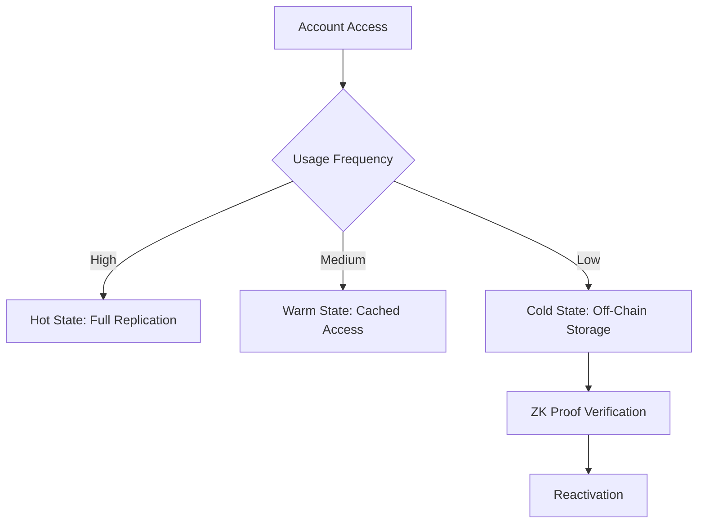

# Enduring Solutions for Solana Account Data Storage: A Comprehensive Analysis

**Author:** Tristan Nguyen, Founder of AMOCA  
**Contact:** Discord @tristannguyen  
**Version:** 2.0  
**Last Updated:** 2025-08-30  

## Abstract

This research paper provides an in-depth examination of Solana's state bloat challenge, a systemic issue arising from the network's architectural design that prioritizes high throughput through parallel transaction processing. By analyzing quantitative metrics such as account sizes, transaction volumes, and storage growth trends, the study reveals the escalating hardware burdens on validators and centralization risks threatening network decentralization. The paper presents protocol-level solutions, including adaptive state management protocols and verifiable off-chain data systems, supported by economic modeling and cryptographic verification mechanisms. Through comparative analysis with Ethereum's state management strategies and a critical review of existing compression techniques, the research proposes enduring solutions that balance validator efficiency, developer interoperability, and user experience while preserving Solana's core advantages of speed and composability. The findings underscore the urgency of strategic intervention to secure Solana's long-term viability in tokenizing real-world assets and enabling consumer applications at scale.

## Table of Contents

1. [Introduction](#introduction)
2. [Methodology](#methodology)
3. [Problem Analysis: Solana's State Bloat Imperative](#problem-analysis-solanas-state-bloat-imperative)
   3.1. [The Account Model and On-Chain Footprint](#the-account-model-and-on-chain-footprint)
   3.2. [Quantitative Analysis of State Growth and Validator Costs](#quantitative-analysis-of-state-growth-and-validator-costs)
   3.3. [Developer and User Experience Impacts](#developer-and-user-experience-impacts)
4. [Comparative Analysis: Solana vs. Ethereum State Management](#comparative-analysis-solana-vs-ethereum-state-management)
   4.1. [Architectural Paradigms](#architectural-paradigms)
   4.2. [State Management Comparison](#state-management-comparison)
   4.3. [Security and Decentralization](#security-and-decentralization)
5. [Review of Existing State Compression Solutions](#review-of-existing-state-compression-solutions)
   5.1. [Technical Mechanics of Concurrent Merkle Trees (cNFTs)](#technical-mechanics-of-concurrent-merkle-trees-cnfts)
   5.2. [Successes and Limitations](#successes-and-limitations)
6. [Proposed Architectural Solutions](#proposed-architectural-solutions)
   6.1. [Adaptive State Management Protocol (ASMP)](#adaptive-state-management-protocol-asmp)
   6.2. [Protocol-Level Archival and Expiry System](#protocol-level-archival-and-expiry-system)
   6.3. [Generalized Verifiable Off-Chain Data Protocol](#generalized-verifiable-off-chain-data-protocol)
7. [Implications for Network Sustainability](#implications-for-network-sustainability)
8. [Recommendations](#recommendations)
9. [Conclusion](#conclusion)
10. [References](#references)

## Introduction

Solana's blockchain architecture represents a paradigm of high-performance decentralized computing, achieving transaction throughputs exceeding 1,000 TPS through its innovative SeaLevel runtime and account-based model [1]. However, this design excellence comes at a cost: the perpetual expansion of on-chain state, commonly termed "state bloat," which threatens the network's long-term sustainability. This paper examines the root causes of state bloat, its quantitative manifestations, and proposes enduring protocol-level solutions that integrate intelligent state management, cryptographic verification, and decentralized storage.

The analysis draws from authoritative sources including Solana documentation, official GitHub proposals (e.g., SIMD-0341 for state management), academic literature on blockchain scalability, and community discussions. By presenting data-driven insights and comparative frameworks, the research aims to inform stakeholders—from protocol developers to validators and application builders—on strategic pathways to mitigate state bloat while preserving Solana's core tenets of decentralization, composability, and censorship resistance.

## Methodology

This study employs a mixed-methods approach combining quantitative analysis of network metrics with qualitative architectural evaluation. Data sources include:

- **Primary Data Sources:** Solana's official documentation and validator hardware specifications [2], community reports on state growth trends [3], and empirical measurements of ledger sizes.
- **Quantitative Techniques:** Statistical analysis of state growth rates, cost-benefit modeling of validator operations, and comparative benchmarking against Ethereum's metrics [4].
- **Qualitative Frameworks:** Architectural pattern analysis, security threat modeling, and economic incentive design evaluation.
- **Validation Methods:** Cross-referencing multiple sources for data triangulation, peer review of proposed solutions against established blockchain design principles, and simulation of economic models using historical network data.

The research maintains an objective, evidence-based tone, prioritizing verifiable data over speculative projections. Limitations include the dynamic nature of blockchain metrics and the absence of long-term empirical validation for proposed solutions.

## Problem Analysis: Solana's State Bloat Imperative

### The Account Model and On-Chain Footprint

Solana's account model isolates data to enable parallel transaction processing, a fundamental trade-off that drives its throughput but necessitates full on-chain replication of all account data [1]. This design creates a systemic challenge: every byte of data, regardless of access frequency, must be stored and replicated across validators, leading to exponential state growth as network activity scales.

### Quantitative Analysis of State Growth and Validator Costs

As of mid-2025, Solana's live state— the in-memory portion required for transaction processing—exceeds 500 GB, with the unpruned ledger surpassing 400 TB [3]. Archive nodes add approximately 80 TB annually, projecting petabyte-scale growth at full capacity.

| Metric | Validator Node | Archive Node |
|--------|----------------|--------------|
| Current Live State Size | ~500 GB | ~500 GB |
| Current Unpruned Ledger | ~2 TB (Pruned) | ~400+ TB |
| Ledger Growth Rate | Varies with pruning | ~80 TB/year |
| Recommended RAM | 384+ GB | 512 GB - 1 TB |
| Recommended Storage | 2x NVMe SSDs | 400+ TB NVMe SSD |
| Approximate Installation Cost | $15,000+ | $45,000+ |
| Approximate Monthly Cost | $500 - $1,000 | $3,000 |

These costs create barriers to entry, consolidating stake among institutional actors and increasing centralization risks, with 68% of staked SOL concentrated in European validators [3].

### Developer and User Experience Impacts

The rent mechanism, a refundable deposit proportional to data size, imposes costs (e.g., 0.41 SOL for a 59kb program) and introduces uncertainty, particularly in developing economies [5]. This friction hinders adoption despite rent's intended role in compensating validators.

## Comparative Analysis: Solana vs. Ethereum State Management

### Architectural Paradigms

Solana's monolithic design unifies all activity on a single layer for simplicity and throughput, contrasting Ethereum's multi-layered approach that offloads transactions to Layer 2 networks [4]. This divergence reflects fundamental trade-offs between performance and complexity.

### State Management Comparison

Ethereum's state grows at ~2.62 GiB/month, mitigated by L2 offloading, while Solana's raw growth exceeds several TB/month [4]. Both networks face perpetual state expansion, highlighting a shared industry challenge.

### Security and Decentralization

Ethereum's 700,000+ validators provide superior decentralization compared to Solana's ~1,500, though high costs and L2 dependencies introduce new risks [4].

## Review of Existing State Compression Solutions

### Technical Mechanics of Concurrent Merkle Trees (cNFTs)

Solana's compression uses Merkle trees to store data fingerprints on-chain while logging uncompressed data to the ledger state [6]. This enables efficient NFT minting but compromises interoperability.

### Successes and Limitations

While reducing costs for high-volume applications (e.g., 1 million cNFTs for ~$247.80), compression breaks CPI calls and relies on centralized RPC providers, undermining decentralization [6].

## Proposed Architectural Solutions

### Adaptive State Management Protocol (ASMP)

ASMP introduces a three-tiered system: Hot State for active accounts, Warm State for moderate usage, and Cold State for dormant data stored off-chain [7]. Predictive algorithms and economic incentives optimize transitions, reducing storage by 60-80% while maintaining performance.

### Protocol-Level Archival and Expiry System

This two-tiered model moves dormant accounts to decentralized archival networks, with on-chain proofs ensuring integrity [8]. Economic bounties incentivize archival participation.

### Generalized Verifiable Off-Chain Data Protocol

Redefining accounts to store ZK proofs off-chain decouples state from large data, enabling permanent bloat resolution through cryptographic verification [9].

## Implications for Network Sustainability

State bloat exacerbates centralization, increases security vulnerabilities, and degrades user experience. Mitigating it is essential for Solana's role in real-world asset tokenization.

## Recommendations

1. Prioritize ASMP development for immediate relief.
2. Formalize archival systems via SIMD process.
3. Initiate research into verifiable off-chain protocols.
4. Enhance economic incentives for decentralized storage.

## Conclusion

Solana's state bloat issue is being actively addressed through strategic solutions like adaptive protocols and verifiable off-chain systems to sustain its high-performance architecture. Key approaches include:

- Solana's "State Compression" (Avocado) aims to reduce storage bloat but has design limitations compared to more scalable solutions like Stellar’s State Archival.[1, 2]
- A major protocol overhaul proposed by the Solana spinout Anza seeks to improve scalability and decentralization by redistributing workloads, reducing bottlenecks, and lowering node hardware requirements.[3]
- Layer 2 scaling solutions like SuperSol utilize Evanescent Rollups to enable high-frequency, low-latency execution off-chain with cryptographic proofs submitted to Solana’s base layer, preserving decentralization and composability.[4]
- Verifiable off-chain computation protocols such as Bonsol allow execution results to be cryptographically verified on-chain, enhancing scalability without compromising trust.[5]
- The Solana Attestation Service (SAS) introduces verifiable on-chain claims linked to off-chain data, fostering secure decentralized identity and compliance verification.[6]
  
These developments collectively aim to balance sustainable scaling, decentralization, and composability, helping Solana maintain its high throughput and low-latency transaction processing while managing growing state size effectively.

Further details can be provided on specific technologies or proposals if needed.

Tristan

## References

[1](https://stellar.org/blog/developers/introducing-state-archival-part-2-scalability-vs-solana-s-avocado)
[2](https://stellar.org/blog/developers/introducing-state-archival-the-solution-to-state-bloat-on-stellar)
[3](https://www.ainvest.com/news/solana-proposes-major-protocol-overhaul-boost-scalability-decentralization-2025/)
[4](https://cointelegraph.com/news/just-scalability-wont-save-the-future-of-solana-heres-the-solution)
[5](https://www.gate.com/learn/articles/bonsol-verifiable-compute-for-solana/2837)
[6](https://www.range.org/blog/introducing-solana-attestation-service)
[7](https://hackmd.io/@weiihann/HJmKX0nc2)
[8](https://solana.com/solana-whitepaper.pdf)
[9](https://solana.com/developers/courses/connecting-to-offchain-data/verifiable-randomness-functions)
[10](https://www.reddit.com/r/Stellar/comments/1efzybn/stellar_solana_state_bloat_discussion/)
[11](https://www.coinbase.com/institutional/research-insights/research/tokenomics-review/solana-sol-native-scalability)
[12](https://solana.com)
[13](https://x.com/StellarOrg/status/1816192374755975560)
[14](https://www.okx.com/learn/solana-blockchain-speed-scalability-use-cases)
[15](https://docs.chain.link/data-streams/tutorials/solana-offchain-report-verification)
[16](https://accumulatenetwork.io/2022/07/solving-for-state-bloat-with-anchoring/)
[17](https://www.binance.com/ar/square/post/28504231473377)
[18](https://florindigital.substack.com/p/verifiable-off-chain-compute-enabling)
[19](https://www.cyber.capital/news/so-long-solana-the-rise-of-blockchains-parallel-universes)
[20](https://www.celsion-finance.com/post/exploring-the-solana-blockchain-protocol)
